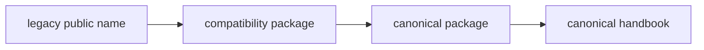

# Legacy Name Map

The legacy-name map is the shortest route from an old public name to its
canonical replacement. It exists to remove ambiguity, not to make the old names
feel equally current.

## Mapping Model

This page should answer the mapping question immediately. Once the reader knows
the old name, the canonical package and current handbook route should be
visible without any additional interpretation.

## Current Map

- `agentic-flows` -> `bijux-canon-runtime`
- `bijux-agent` -> `bijux-canon-agent`
- `bijux-rag` -> `bijux-canon-ingest`
- `bijux-rar` -> `bijux-canon-reason`
- `bijux-vex` -> `bijux-canon-index`

## What To Check Next

- the compatibility package `README.md` for the checked-in canonical target
- the canonical package handbook for current behavior
- migration pages when the question turns from mapping into retirement timing

## First Proof Check

- `packages/compat-*`
- compatibility package `README.md` files
- canonical handbooks under `docs/02-bijux-canon-ingest/` through
  `docs/06-bijux-canon-runtime/`

## Design Pressure

If the map leaves room to wonder whether the legacy name is still a peer to the
canonical package, it has failed. The whole point is to collapse ambiguity, not
to preserve nostalgia.
