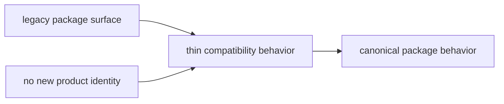

# Package Behavior

Each compatibility package should stay intentionally thin. Its job is to
preserve a narrow bridge to the canonical package through metadata, imports,
commands, and documentation routing.

## Behavior Model

This page should make compatibility behavior feel constrained on purpose. The
package exists to redirect and preserve continuity, not to grow a second
feature surface around the old name.

## Expected Behavior

- preserve legacy name continuity for installs, imports, or commands
- point clearly at the canonical replacement in package metadata and docs
- avoid growing a separate feature surface or product identity

## Failure Signs

- the compatibility package starts carrying new behavior of its own
- documentation makes the legacy name sound like a preferred starting point
- release activity exists only to mirror canonical releases without a real
  dependent environment behind it

## First Proof Check

- `packages/compat-*`
- compatibility package `README.md` files
- release and retirement rules in the migration handbook

## Design Pressure

If a compatibility package starts accumulating local behavior, the bridge has
turned into an unofficial product line. This page has to keep the acceptable
surface narrow enough that retirement still looks realistic.
