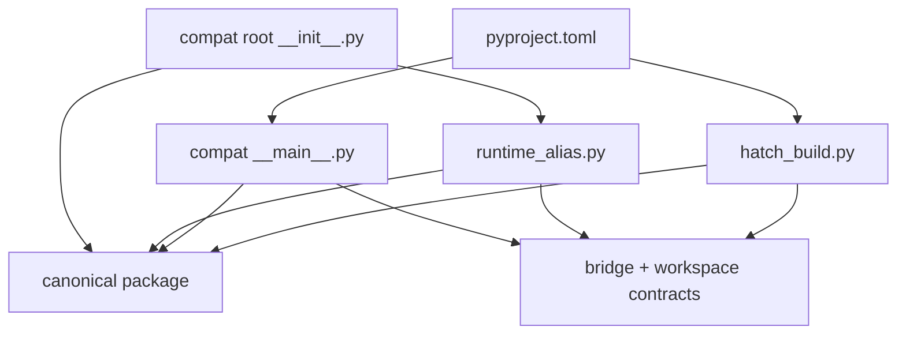

# Package Behavior

A compatibility distribution is executable delegation. It installs a canonical
package at the exact same version, forwards imports to canonical module objects,
and preserves an established command name. It does not copy or wrap product
algorithms.

## Bridge Anatomy

```mermaid
flowchart TD
    pyproject["pyproject.toml"]
    hook["hatch_build.py"]
    init["compat root __init__.py"]
    finder["runtime_alias.py"]
    main["compat __main__.py"]
    canonical["canonical package"]
    tests["bridge + workspace contracts"]

    pyproject --> hook --> canonical
    pyproject --> main --> canonical
    init --> finder --> canonical
    init --> canonical
    hook --> tests
    finder --> tests
    main --> tests
```

## Build-Time Dependency

The compatibility `pyproject.toml` declares version and dependencies as dynamic.
Its metadata hook reads `canonical-name` and writes one exact requirement using
the resolved bridge version. The resulting wheel therefore cannot float to a
different canonical minor or patch version.

This dependency belongs to built metadata; absence of a literal dependencies
list in the source `pyproject.toml` is intentional. Inspect a built wheel or the
metadata-hook tests when reviewing the resolved requirement.

## Import Forwarding

The root `__init__.py` imports the canonical package, publishes the canonical
`__all__`, forwards attribute lookup, and exposes canonical names to interactive
discovery. It also installs a meta-path finder for nested imports.

For a non-local path, the finder:

1. removes the compatibility root prefix;
2. checks whether the corresponding canonical module exists;
3. imports that canonical module;
4. registers the same module object under the compatibility path.

Using one object preserves type and class identity across mixed imports. The
finder excludes locally owned bridge modules such as `runtime_alias` and
`__main__`.

## Command Delegation

Each bridge registers its preserved executable directly against the canonical
entrypoint, and its local `__main__.py` launches that same application for
`python -m <compat_import>`. It must not introduce a second parser or translate
arguments independently.

`bijux-vex` and `bijux-canon-index` register the same canonical index Typer
application. This preserves existing automation while making the owner command
available directly.

## Verified And Unverified Claims

| Claim | Repository evidence | Boundary |
| --- | --- | --- |
| bridge installs the matching canonical release | metadata hook and build tests | resolved artifact metadata, not source text alone |
| root exports follow canonical exports | bridge unit tests | documented public exports |
| representative nested types retain identity | nested import identity tests | tested paths, not every private module forever |
| CLI module resolves to canonical identity | CLI module identity tests | module identity, not every external shell environment |
| console target delegates to canonical entrypoint | project metadata and compatibility contracts | registered target; behavior still belongs to canonical tests |
| compatibility package is releasable | workspace inventory and publication tests | eligibility, not proof that a channel published it |

## Forbidden Divergence

A bridge has diverged if it contains product algorithms, its own schema, a
separate parser, bridge-only configuration semantics, independent storage, or a
bug fix absent from the canonical owner. Correct the canonical package first and
keep the compatibility change limited to delegation or migration support.

See the [canonical targets](../migration/canonical-targets.md) for exact
destinations and [validation strategy](../migration/validation-strategy.md) for
migration evidence.
