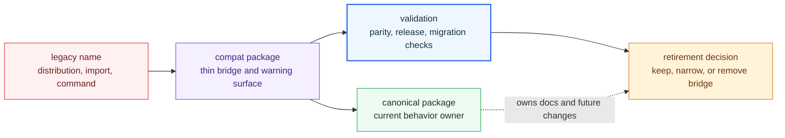

# Compatibility Packages

The compatibility handbook covers the legacy distribution, import, and command
names that still exist while the canonical `bijux-canon-*` package family takes
over. These packages are migration bridges, not equal design centers.

That distinction has to stay explicit. A preserved legacy name may protect a
real dependent environment, but it still carries maintenance debt and should
always point toward the canonical package that owns current behavior.

## Bridge Model

Compatibility packages exist to protect users during migration. They should
make old names work long enough to move responsibly, but every page in this
handbook should pull readers toward the canonical package that owns current
behavior and future design.

## Handbook Sections

- [Catalog](https://bijux.io/bijux-canon/08-compat-packages/catalog/) for the
  exact legacy names still shipped, the surfaces they preserve, and the
  canonical packages they point to
- [Migration](https://bijux.io/bijux-canon/08-compat-packages/migration/) for
  continuity rules, validation, release posture, and retirement conditions

## Legacy Package Map

| Legacy package | Canonical target | Reader action |
| --- | --- | --- |
| `agentic-flows` | `bijux-canon-runtime` | use the bridge only while migrating execution and replay surfaces |
| `bijux-agent` | `bijux-canon-agent` | move orchestration imports, commands, and docs to the canonical agent package |
| `bijux-rag` | `bijux-canon-ingest` | move document preparation and retrieval-preparation work to ingest docs |
| `bijux-rar` | `bijux-canon-reason` | move reasoning, claim, and verification review to reason docs |
| `bijux-vex` | `bijux-canon-index` | move vector execution and retrieval provenance review to index docs |

## Start With

- Open [Catalog](https://bijux.io/bijux-canon/08-compat-packages/catalog/)
  when you already have a legacy name and need the current canonical target.
- Open [Migration](https://bijux.io/bijux-canon/08-compat-packages/migration/)
  when the question is whether the bridge is still justified, how to migrate off
  it, or when it can be retired.

## Proof Path

- `packages/compat-*` contains the shipped bridges.
- compatibility package `README.md` files should name the canonical targets.
- canonical package handbooks under `docs/02-...` through `docs/06-...` own
  current behavior.
- migration pages under `docs/08-compat-packages/migration/` explain when a bridge is still justified.

## Retirement Rule

A preserved legacy name stays only when it protects a real dependent
environment or a documented migration window. Habit, nostalgia, or naming
symmetry are not enough.
