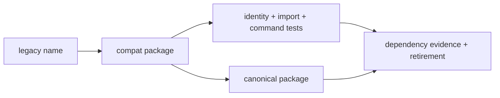
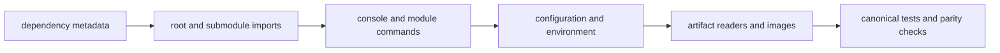

# Compatibility Packages

Six compatibility distributions preserve established installation, import,
submodule, module-execution, and command names while delegating behavior to a
canonical `bijux-canon-*` package. Five preserve earlier product names;
`bijux-canon` preserves the shorter family-root name for the runtime package.

These are executable aliases, not empty deprecation wheels. Their root modules
forward attributes, their import finders map non-local submodules to canonical
modules, their `__main__` modules invoke canonical commands, and their package
metadata registers the preserved console scripts.

## Bridge Model

```mermaid
flowchart LR
    legacy["legacy name"]
    bridge["compat package"]
    canonical["canonical package"]
    tests["identity + import + command tests"]
    retire["dependency evidence + retirement"]

    legacy --> bridge --> canonical
    bridge --> tests --> retire
    canonical --> retire
```

## Exact Name Map

| Distribution | Import root | Command | Canonical owner |
| --- | --- | --- | --- |
| `bijux-canon` | `bijux_canon` | `bijux-canon` | `bijux-canon-runtime` |
| `agentic-flows` | `agentic_flows` | `agentic-flows` | `bijux-canon-runtime` |
| `bijux-agent` | `bijux_agent` | `bijux-agent` | `bijux-canon-agent` |
| `bijux-rag` | `bijux_rag` | `bijux-rag` | `bijux-canon-ingest` |
| `bijux-rar` | `bijux_rar` | `bijux-rar` | `bijux-canon-reason` |
| `bijux-vex` | `bijux_vex` | `bijux-vex` | `bijux-canon-index` |

`bijux-vex` currently supplies the preserved console entrypoint even though the
canonical index distribution does not register its own console script. This is
an observable asymmetry in current packaging, not proof that the compatibility
package owns index behavior.

## What Equivalence Means

Compatibility is a set of observable surfaces, not a statement that two names
look similar:

| Surface | Required evidence | Insufficient evidence |
| --- | --- | --- |
| installation | exact canonical dependency and synchronized version | both wheels install independently |
| root import | forwarded attributes, `__all__`, and discovery | one symbol imports |
| submodule import | alias and canonical names resolve to the same module object | duplicate implementations with similar APIs |
| module execution | bridge `__main__` invokes the canonical entrypoint | a separate parser with matching options |
| console command | preserved script delegates arguments, output, and exit status | command name exists |
| runtime behavior | canonical tests pass through the bridge where applicable | one successful example |
| release | bridge and canonical artifacts derive from the same tag and version | matching version strings alone |

The repository currently verifies root exports, selected nested module identity,
package layout, canonical dependency metadata, and registered console targets.
Those checks are strong evidence for delegation at the tested surfaces; they do
not promise that an arbitrary undocumented private import will remain available.

A bridge may contain alias machinery and a local `__main__`; it must not contain
a second product implementation. New behavior, schemas, examples, and fixes
belong to the canonical package first.

## Resolve A Preserved Name

| Existing name | Canonical destination | Migration focus |
| --- | --- | --- |
| `bijux-canon` | `bijux-canon-runtime` | distribution, import, command, runtime artifacts |
| `agentic-flows` | `bijux-canon-runtime` | execution manifests, replay commands, imports |
| `bijux-agent` | `bijux-canon-agent` | orchestration imports, configuration, commands |
| `bijux-rag` | `bijux-canon-ingest` | preparation imports, commands, artifact readers |
| `bijux-rar` | `bijux-canon-reason` | reasoning imports, run directories, verification commands |
| `bijux-vex` | `bijux-canon-index` | vector contracts, module command, provenance artifacts |

Start with the [catalog](catalog/index.md) for exact package behavior and the
[migration handbook](migration/index.md) for continuity and retirement rules.

## Migrate Without Splitting Identity

```mermaid
flowchart LR
    dependencies[dependency metadata]
    imports[root and submodule imports]
    commands[console and module commands]
    config[configuration and environment]
    artifacts[artifact readers and images]
    parity[canonical tests and parity checks]

    dependencies --> imports --> commands --> config --> artifacts --> parity
```

Move and verify one observable surface at a time. Mixing bridge imports with
canonical artifact readers can leave identity embedded in caches, manifests,
or automation even after dependency metadata changes. Keep the bridge until
all dependent environments have moved; do not add new bridge-only behavior to
make a partial migration permanent.

## Compatibility Invariants

- installing a bridge installs its exact canonical package dependency
- root attributes and `__all__` follow the canonical package
- non-local alias submodules resolve to canonical module objects
- local `__main__` and alias machinery remain owned by the bridge
- preserved console scripts call canonical entrypoints
- bridge and canonical versions move on the same tagged release line
- new behavior and new documentation belong to the canonical package first

## Retirement Rule

A preserved legacy name stays only when it protects a real dependent
environment or a documented migration window. No removal date is implied by
the existence of these pages. A retirement decision needs usage evidence,
release communication, and validation that supported consumers have moved.
Habit or naming symmetry alone is not enough to extend a bridge indefinitely.

## Migration Proof

A migration is complete only after dependency metadata, imports, submodule
imports, command invocations, configuration names, artifact readers, and
deployment images use the canonical identity and pass the canonical package's
tests. Replacing only the distribution name can leave runtime imports or shell
automation on the compatibility path.

For `bijux-vex`, command migration is not a rename: `bijux-canon-index` does not
publish a console script. Move that automation to the canonical typed Python or
HTTP surface before removing the compatibility package.
