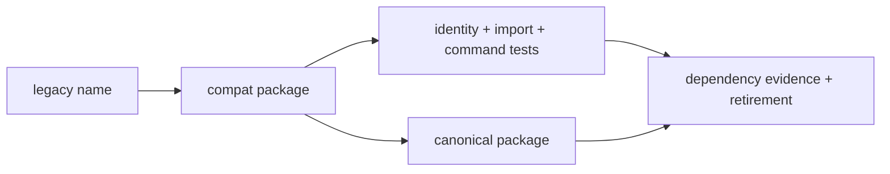

# Compatibility Packages

Six compatibility distributions preserve established installation, import,
submodule, module-execution, and command names while delegating behavior to a
canonical `bijux-canon-*` package. Five preserve earlier product names;
`bijux-canon` preserves the shorter family-root name for the runtime package.

These are executable aliases, not empty deprecation wheels. Their root modules
forward attributes, their import finders map non-local submodules to canonical
modules, their `__main__` modules invoke canonical commands, and their package
metadata registers the preserved console scripts.

## Bridge Model

```mermaid
flowchart LR
    legacy["legacy name"]
    bridge["compat package"]
    canonical["canonical package"]
    tests["identity + import + command tests"]
    retire["dependency evidence + retirement"]

    legacy --> bridge --> canonical
    bridge --> tests --> retire
    canonical --> retire
```

## Exact Name Map

| Distribution | Import root | Command | Canonical owner |
| --- | --- | --- | --- |
| `bijux-canon` | `bijux_canon` | `bijux-canon` | `bijux-canon-runtime` |
| `agentic-flows` | `agentic_flows` | `agentic-flows` | `bijux-canon-runtime` |
| `bijux-agent` | `bijux_agent` | `bijux-agent` | `bijux-canon-agent` |
| `bijux-rag` | `bijux_rag` | `bijux-rag` | `bijux-canon-ingest` |
| `bijux-rar` | `bijux_rar` | `bijux-rar` | `bijux-canon-reason` |
| `bijux-vex` | `bijux_vex` | `bijux-vex` | `bijux-canon-index` |

`bijux-vex` currently supplies the preserved console entrypoint even though the
canonical index distribution does not register its own console script. This is
an observable asymmetry in current packaging, not proof that the compatibility
package owns index behavior.

## Handbook Sections

- [Catalog](https://bijux.io/bijux-canon/08-compat-packages/catalog/) for the
  exact legacy names still shipped, the surfaces they preserve, and the
  canonical packages they point to
- [Migration](https://bijux.io/bijux-canon/08-compat-packages/migration/) for
  continuity rules, validation, release posture, and retirement conditions

## Compatibility Package Map

| Compatibility package | Canonical target | Reader action |
| --- | --- | --- |
| `bijux-canon` | `bijux-canon-runtime` | use the bridge only when an existing environment still expects the shorter family-root runtime name |
| `agentic-flows` | `bijux-canon-runtime` | use the bridge only while migrating execution and replay surfaces |
| `bijux-agent` | `bijux-canon-agent` | move orchestration imports, commands, and docs to the canonical agent package |
| `bijux-rag` | `bijux-canon-ingest` | move document preparation and retrieval-preparation work to ingest docs |
| `bijux-rar` | `bijux-canon-reason` | move reasoning, claim, and verification review to reason docs |
| `bijux-vex` | `bijux-canon-index` | move vector execution and retrieval provenance review to index docs |

## Start With

- Open [Catalog](https://bijux.io/bijux-canon/08-compat-packages/catalog/)
  when you already have a legacy name and need the current canonical target.
- Open [Migration](https://bijux.io/bijux-canon/08-compat-packages/migration/)
  when the question is whether the bridge is still justified, how to migrate off
  it, or when it can be retired.

## Proof Path

- `packages/compat-*` contains the shipped bridges.
- compatibility package `README.md` files should name the canonical targets.
- canonical package handbooks under `docs/02-...` through `docs/06-...` own
  current behavior.
- migration pages under `docs/08-compat-packages/migration/` explain when a bridge is still justified.

## Compatibility Invariants

- installing a bridge installs its exact canonical package dependency
- root attributes and `__all__` follow the canonical package
- non-local alias submodules resolve to canonical module objects
- local `__main__` and alias machinery remain owned by the bridge
- preserved console scripts call canonical entrypoints
- bridge and canonical versions move on the same tagged release line
- new behavior and new documentation belong to the canonical package first

## Retirement Rule

A preserved legacy name stays only when it protects a real dependent
environment or a documented migration window. Habit, nostalgia, or naming
symmetry are not enough.

## Migration Proof

A migration is complete only after dependency metadata, imports, submodule
imports, command invocations, configuration names, artifact readers, and
deployment images use the canonical identity and pass the canonical package's
tests. Replacing only the distribution name can leave runtime imports or shell
automation on the compatibility path.
