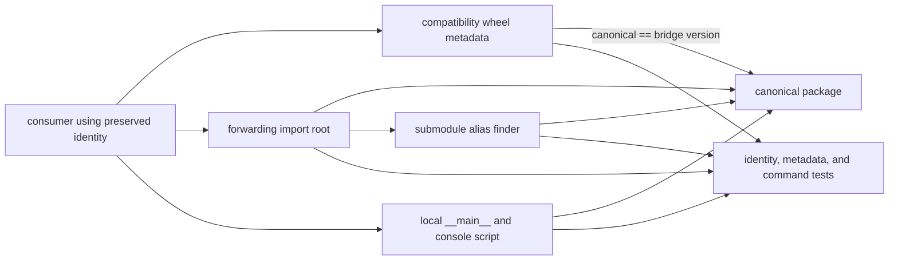

# Compatibility Packages

Six distributions preserve established Bijux package identities while the
implementation lives in five canonical `bijux-canon-*` packages. Installing a
bridge installs its canonical owner at the identical version; importing the
preserved root or a mapped submodule reaches canonical objects; invoking the
preserved command dispatches the canonical command application.

The bridges are executable compatibility contracts, not independent products
and not empty deprecation wheels.

## Name and Authority Map

| Preserved distribution | Import root | Preserved command | Canonical owner |
| --- | --- | --- | --- |
| `bijux-canon` | `bijux_canon` | `bijux-canon` | `bijux-canon-runtime` |
| `agentic-flows` | `agentic_flows` | `agentic-flows` | `bijux-canon-runtime` |
| `bijux-agent` | `bijux_agent` | `bijux-agent` | `bijux-canon-agent` |
| `bijux-rag` | `bijux_rag` | `bijux-rag` | `bijux-canon-ingest` |
| `bijux-rar` | `bijux_rar` | `bijux-rar` | `bijux-canon-reason` |
| `bijux-vex` | `bijux_vex` | `bijux-vex` | `bijux-canon-index` |

`bijux-canon` preserves the shorter family-root identity for runtime. The
other five names preserve products consolidated into this repository.

## One Implementation, Two Names

```mermaid
flowchart LR
    consumer["consumer using preserved identity"]
    metadata["compatibility wheel metadata"]
    root["forwarding import root"]
    finder["submodule alias finder"]
    command["local __main__ and console script"]
    owner["canonical package"]
    evidence["identity, metadata, and command tests"]

    consumer --> metadata -->|"canonical == bridge version"| owner
    consumer --> root --> owner
    root --> finder --> owner
    consumer --> command --> owner
    metadata --> evidence
    root --> evidence
    finder --> evidence
    command --> evidence
```

Each compatibility source tree owns only the machinery required to preserve
its public identity: `__init__.py`, `runtime_alias.py`, `__main__.py`, package
metadata, a type marker, and bridge tests. Algorithms, schemas, storage,
configuration policy, and product examples remain with the canonical owner.

## Guarantees and Limits

| Surface | Compatibility guarantee | Limit |
| --- | --- | --- |
| dependency resolution | built metadata requires the canonical distribution at the same version | availability on a package index must still be checked |
| root import | public attributes, `__all__`, version, and discovery forward to the canonical root | private names are not promoted to supported API |
| nested import | non-local alias modules resolve to canonical module objects | bridge-local alias machinery and `__main__` remain distinct modules |
| module execution | `python -m <preserved_root>` calls the canonical CLI | canonical command availability and behavior still define the result |
| console script | the preserved executable delegates to the canonical entrypoint | existence of a command is not proof of artifact compatibility |
| behavior | canonical exceptions, output, and exit semantics pass through the bridge | the bridge does not add a second behavior contract |
| release | bridge and owner resolve the repository version together | a shared tag does not prove every artifact was published |
| runtime composition | aliases expose exactly the canonical runtime and lower-package roots | aliases cannot add missing live adapter callables |

The repository checks root exports, representative nested-module identity,
runtime-alias layout, exact dependency metadata, console targets, README
routing, and package contents. Those checks establish the tested surfaces;
they do not promise continuity for arbitrary undocumented deep imports.

The last limit is especially important for `bijux-canon`. It aliases
`bijux-canon-runtime`; it is not the complete package family and not an adapter
bundle. Likewise, `bijux-rag`, `bijux-vex`, `bijux-rar`, and `bijux-agent`
mirror their canonical roots. If a canonical root lacks a runtime-requested
callable, its preserved root lacks it too. Alias identity tests and command
parity therefore cannot establish a live agent-to-retrieval-to-reasoning flow.

## Locate A Bridge Failure

The consumer-visible name identifies the bridge; the failed decision identifies
the owner:

| Observation | Inspect first | Durable fix belongs in |
| --- | --- | --- |
| bridge wheel resolves the wrong canonical version | built metadata and custom metadata hook | compatibility package build contract |
| preserved root or nested import resolves a different object | facade, alias finder, and representative identity tests | compatibility package alias machinery |
| preserved command is absent | bridge project scripts and wheel metadata | compatibility package entrypoint declaration |
| preserved command runs but rejects arguments or emits a different result | canonical CLI and bridge delegation target | canonical package unless delegation itself is wrong |
| product result, artifact, or schema is incorrect through both names | canonical implementation and contract tests | canonical package |
| historical artifact cannot be read after a name-only migration | consumer inventory and canonical artifact contract | owning product boundary or an explicit migration tool |
| runtime plan succeeds but live execution cannot load a lower package | runtime loader diagnostics and canonical package adapter contract | runtime-owned integration boundary |

Do not add translation logic to make a bridge conceal a canonical defect. A
bridge is trustworthy when it preserves identity and exposes canonical behavior
unchanged—including typed failures and command exit status. If compatibility
requires transforming data or policy, that transformation needs an explicit
owner and contract outside the alias package.

## Choose the Right Route

| Need | Continue with |
| --- | --- |
| identify one preserved package, import, command, or canonical owner | [Compatibility catalog](catalog/index.md) |
| understand bridge installation and delegation | [Compatibility overview](migration/compatibility-overview.md) |
| move a consumer without losing import, command, configuration, or artifact continuity | [Migration guidance](migration/migration-guidance.md) |
| resolve bridge and canonical versions in one environment | [Dependency continuity](migration/dependency-continuity.md) |
| validate a built bridge or release candidate | [Validation strategy](migration/validation-strategy.md) |
| decide whether a bridge may stop receiving releases | [Retirement conditions](migration/retirement-conditions.md) |

## Known Asymmetries

- `bijux-canon` and `agentic-flows` both delegate to
  `bijux-canon-runtime`; they can coexist only when both exact pins resolve to
  the same runtime version.
- `bijux-vex` preserves the `bijux-vex` console script while
  `bijux-canon-index` does not publish a renamed console script. Command
  migration therefore moves to the canonical Python or HTTP interface rather
  than performing a text-only rename.
- `bijux-rar` remains a console script in the canonical reason distribution as
  well as in the compatibility distribution. Command availability alone does
  not show which distribution, import root, or artifact reader a consumer uses.

These asymmetries are packaging facts. They do not transfer runtime, index, or
reasoning ownership to the compatibility distribution.

## Migration Completion

A consumer has left a bridge only when its dependency metadata, lockfiles,
root and submodule imports, console and module commands, entrypoint strings,
configuration, container images, artifact readers, and recovery automation use
the canonical identity. The canonical package must then pass the consumer's
representative workflow against retained artifacts.

For runtime consumers, representative means more than constructing a
`FlowManifest`, resolving plan mode, or comparing the two commands. Test the
live adapters separately against the installed canonical packages and verify
the resulting evidence, contract, claim, trace, and artifact identities. That
test may expose an existing canonical integration gap; a compatibility bridge
must preserve that typed failure rather than hide it with bridge-local product
logic.

Removing a name from source while a deployed image, plugin declaration, or
historical artifact reader still needs it is an incomplete migration. Keep the
bridge exact, thin, and behavior-free until the supported consumer inventory
shows that every preserved surface can be retired.
