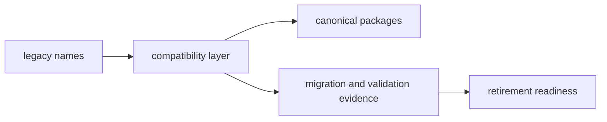

# Compatibility Overview

The compatibility layer exists to reduce migration breakage while the canonical
`bijux-canon-*` family becomes the only normal starting point for new work.
Preserving an old public name is sometimes necessary, but it is still debt that
should stay visible.

## Bridge Model

This page should make one idea obvious: compatibility is a controlled handoff,
not a second product line. A preserved name is acceptable only when it still
protects a supported environment on the way to the canonical package.

## Preserved Surfaces

- legacy distribution names
- legacy Python import names
- legacy command names where those still exist

## Bridge Rule

A preserved legacy surface is acceptable only when it shields a real supported
environment during migration. The bridge loses legitimacy as soon as it becomes
an excuse to postpone migration indefinitely.

## First Proof Check

- `packages/compat-*`
- compatibility package `README.md` targets
- migration validation and retirement pages

## Design Pressure

If this overview makes the legacy name feel comfortable instead of temporary,
the reader loses sight of the real goal. The section has to keep the migration
cost and the retirement path visible at the same time.
