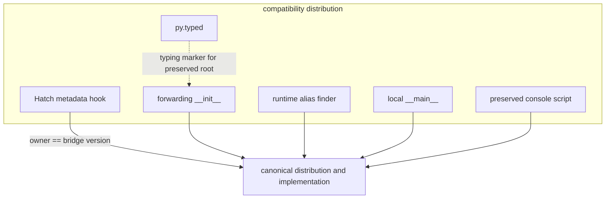
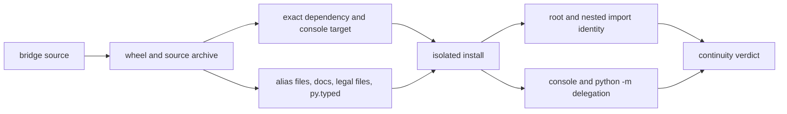

# Compatibility Overview

The compatibility layer preserves six distribution, import, module-execution,
and command identities while all product behavior remains in five canonical
packages. Every bridge is version-locked to its owner and delegates at runtime;
none carries an independent algorithm, schema, or storage implementation.

## Bridge Anatomy

```mermaid
flowchart TB
    subgraph wheel["compatibility distribution"]
        metadata["Hatch metadata hook"]
        init["forwarding __init__"]
        alias["runtime alias finder"]
        main["local __main__"]
        script["preserved console script"]
        marker["py.typed"]
    end

    owner["canonical distribution and implementation"]
    metadata -->|"owner == bridge version"| owner
    init --> owner
    alias --> owner
    main --> owner
    script --> owner
    marker -. "typing marker for preserved root" .-> init
```

The build hook receives the VCS-derived package version and writes one exact
canonical dependency into built metadata. The forwarding root exposes
canonical public attributes and discovery. The meta-path finder maps non-local
legacy submodules to canonical module objects. `__main__` and the console entry
delegate to the canonical command application.

## Preserved Identities

| Bridge | Canonical owner | Migration consequence |
| --- | --- | --- |
| `bijux-canon` | `bijux-canon-runtime` | move runtime imports, command automation, manifests, and run-store tooling |
| `agentic-flows` | `bijux-canon-runtime` | move flow imports and commands to the same runtime owner |
| `bijux-agent` | `bijux-canon-agent` | move orchestration imports, provider configuration, and traces |
| `bijux-rag` | `bijux-canon-ingest` | move preparation imports, commands, caches, and artifact readers |
| `bijux-rar` | `bijux-canon-reason` | move reasoning imports and run-bundle verification |
| `bijux-vex` | `bijux-canon-index` | move imports and redesign command automation around Python or HTTP |

Two preserved identities target runtime. That is intentional: one protects the
shorter `bijux-canon` family name and one protects the former
`agentic-flows` product name. Both resolve to one canonical implementation and
must agree on its exact version when installed together.

## Local and Aliased Modules

Not every module under a preserved root is the same kind of object:

| Module | Ownership | Identity expectation |
| --- | --- | --- |
| preserved root `__init__` | bridge | forwards canonical exports but remains the preserved root module |
| `runtime_alias` | bridge | installs the alias machinery and is not a product API |
| `__main__` | bridge | dispatches the canonical command under the preserved module name |
| mapped product submodule | canonical owner | preserved and canonical import names resolve to the same module object |

This distinction prevents the bridge's own loader and entrypoint code from
being mistaken for a second implementation. Consumer migration should target
canonical product modules, not the bridge-local machinery.

## Compatibility Evidence

```mermaid
flowchart LR
    source["bridge source"] --> build["wheel and source archive"]
    build --> metadata["exact dependency and console target"]
    build --> layout["alias files, docs, legal files, py.typed"]
    metadata --> install["isolated install"]
    layout --> install
    install --> import["root and nested import identity"]
    install --> command["console and python -m delegation"]
    import --> result["continuity verdict"]
    command --> result
```

Continuity is supported only at surfaces exercised by this chain. Source-tree
imports do not prove built metadata; a command name in `pyproject.toml` does not
prove installed dispatch; a shared version string does not prove publication;
and one successful call does not establish compatibility for private imports.

## Behavior and Artifact Boundary

Canonical packages define public values, errors, exit semantics, schemas, and
artifact meaning. A compatibility bridge passes those through. It cannot make
an artifact compatible merely by preserving an old module name, and it cannot
translate a canonical refusal into legacy success.

During migration, test the consumer's historical artifacts with canonical
readers. Index files, caches, manifests, traces, and databases may contain
package, schema, backend, or model identity that import forwarding cannot
change. When conversion is necessary, preserve the original and produce a new
artifact with its own canonical identity.

## Lifecycle Boundary

Keep a bridge while a named supported consumer still requires one of its
preserved surfaces or while an announced migration window remains active. Stop
adding new dependencies on it immediately: new consumers should start on the
canonical owner.

Retirement requires consumer evidence, not age or repository tidiness. Follow
[migration guidance](migration-guidance.md) for cutover,
[validation strategy](validation-strategy.md) for executable proof, and
[retirement conditions](retirement-conditions.md) for the final decision.
