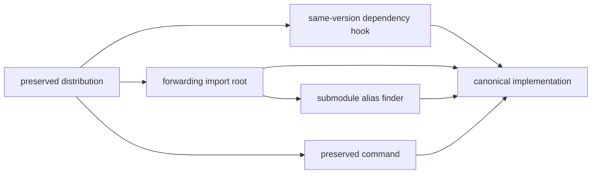

# Compatibility Overview

The compatibility layer preserves six public identities while implementation
remains in five canonical `bijux-canon-*` packages. It provides continuity for
installed distributions, Python imports, module execution, and console commands
without creating parallel product implementations.

`bijux-canon` is the shorter runtime-family identity. The other five bridges
preserve earlier product names: `agentic-flows`, `bijux-agent`, `bijux-rag`,
`bijux-rar`, and `bijux-vex`.

## Resolution Path

```mermaid
flowchart LR
    install["preserved distribution"]
    hook["same-version dependency hook"]
    root["forwarding import root"]
    finder["submodule alias finder"]
    command["preserved command"]
    canonical["canonical implementation"]

    install --> hook --> canonical
    install --> root --> canonical
    root --> finder --> canonical
    install --> command --> canonical
```

Each bridge's Hatch metadata hook pins its canonical dependency to the resolved
compatibility version. Its root package forwards canonical exports. A
meta-path finder maps non-local compatibility submodules to the same canonical
module objects. The local `__main__` module and registered console script call
the canonical entrypoint.

## Preserved Surfaces

| Surface | Bridge responsibility | Verification |
| --- | --- | --- |
| distribution | publish the preserved name and depend on the exact canonical version | build metadata and publication contract tests |
| root import | expose canonical `__all__`, attributes, version, and discovery | bridge unit tests |
| submodule import | resolve selected nested paths to canonical module identity | identity assertions in each bridge test |
| `python -m` | invoke the owning package's command application | local `__main__.py` and command tests |
| console script | register the preserved executable name against the canonical entrypoint | project metadata and workspace compatibility tests |
| type marker | ship `py.typed` for the compatibility import root | package layout contract |

These are tested commitments, not a license to depend on every private module
reachable through the alias finder. Supported product behavior, schemas, and
examples remain those of the canonical owner.

## Canonical Ownership

| Bridge | Canonical owner | Migration shape |
| --- | --- | --- |
| `bijux-canon` | `bijux-canon-runtime` | direct distribution, import, and command rename |
| `agentic-flows` | `bijux-canon-runtime` | move flow manifests and runtime automation to runtime identity |
| `bijux-agent` | `bijux-canon-agent` | direct distribution, import, and command rename |
| `bijux-rag` | `bijux-canon-ingest` | move preparation imports, commands, and artifact readers |
| `bijux-rar` | `bijux-canon-reason` | move reasoning imports, commands, and run readers |
| `bijux-vex` | `bijux-canon-index` | replace distribution and imports; redesign command automation around Python or HTTP |

The last row is intentionally asymmetric. `bijux-vex` preserves a command whose
canonical distribution does not publish a renamed equivalent.

## Compatibility Boundary

A bridge may own alias plumbing, local command launchers, packaging metadata,
tests, and migration notes. It must not own algorithms, schemas, storage
semantics, configuration policy, or new user-facing features. A defect in
canonical behavior is fixed in the canonical package and then observed through
the bridge.

## Lifecycle Evidence

Keeping or retiring a bridge is an operational decision. Evidence should cover
known dependency pins, imports in deployed code, command invocations, container
references, artifact readers, and an announced support window. Absence from this
repository's source is not proof that external consumers no longer exist.

Continue with [canonical targets](canonical-targets.md) for exact destinations,
[migration guidance](migration-guidance.md) for a runnable inventory process,
and [retirement conditions](retirement-conditions.md) for closure evidence.
