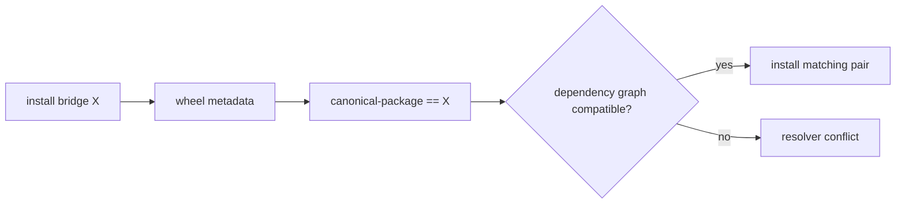

# Dependency Continuity

A compatibility distribution is a version-locked dependency bridge. A built
bridge at version `X` requires its canonical distribution at exactly version
`X`. This keeps preserved imports and commands attached to the implementation
release whose exports and entrypoints they were tested against.

## Resolution Contract



| Compatibility distribution | Exact canonical requirement generated at build |
| --- | --- |
| `bijux-canon` | `bijux-canon-runtime==<version>` |
| `agentic-flows` | `bijux-canon-runtime==<version>` |
| `bijux-agent` | `bijux-canon-agent==<version>` |
| `bijux-rag` | `bijux-canon-ingest==<version>` |
| `bijux-rar` | `bijux-canon-reason==<version>` |
| `bijux-vex` | `bijux-canon-index==<version>` |

The requirement is generated by each package's Hatch metadata hook after Hatch
resolves the shared VCS version. It is intentionally absent as a literal
dependency list in the source `pyproject.toml`. Inspect built wheel metadata or
the metadata-hook contract when verifying the final requirement.

## Resolver Behavior Is Protective

If an application already requires a different canonical version, installing a
bridge may produce a dependency conflict. Do not loosen the bridge to a range
to make that graph resolve. A range could attach preserved modules and console
targets to a canonical release the bridge did not validate.

Choose one coherent outcome:

- align the bridge and canonical package on the same release;
- migrate the consumer fully to the canonical distribution; or
- retain the existing environment until its dependency graph can move as a
  tested unit.

Two compatibility distributions may target one canonical package. For example,
`bijux-canon` and `agentic-flows` can coexist when both resolve to the same
runtime version. They expose different preserved roots and commands but share
one runtime implementation.

## What The Exact Pin Does Not Prove

The pin proves dependency alignment in built metadata. It does not prove that a
particular release was uploaded, that an index selected the expected artifact,
that every private import still exists, or that a consumer's stored artifacts
remain compatible. Verify installed versions and exercise the surfaces the
consumer actually uses.

```bash
python -m pip show bijux-rag bijux-canon-ingest
python -m pip check
```

For reproducible environments, retain hashes or lockfile records for both
artifacts. A lock update is part of the migration evidence because it reveals
whether the dependency graph changed beyond the intended bridge pair.

Continue with [release policy](release-policy.md) for publication evidence and
[validation strategy](validation-strategy.md) for bridge-level checks.
