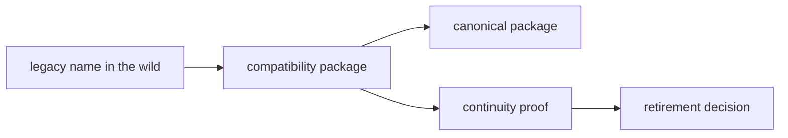

# Migration

The migration section covers how legacy names stay alive temporarily, how the
canonical package family takes over, and what evidence is required before a
compatibility package can disappear.

Migration documentation should bias toward closure, not coexistence. The bridge
is successful when the canonical package can carry the work alone without
stranding supported environments.

## Bridge Lifecycle

Migration docs should make the bridge feel temporary but well controlled. A
reader needs to see where the old name still matters, where the canonical
target already owns the real behavior, and what proof is required before the
bridge can be removed.

## Migration Pages

- [Compatibility Overview](https://bijux.io/bijux-canon/08-compat-packages/migration/compatibility-overview/)
- [Migration Guidance](https://bijux.io/bijux-canon/08-compat-packages/migration/migration-guidance/)
- [Repository Consolidation](https://bijux.io/bijux-canon/08-compat-packages/migration/repository-consolidation/)
- [Canonical Targets](https://bijux.io/bijux-canon/08-compat-packages/migration/canonical-targets/)
- [Dependency Continuity](https://bijux.io/bijux-canon/08-compat-packages/migration/dependency-continuity/)
- [Release Policy](https://bijux.io/bijux-canon/08-compat-packages/migration/release-policy/)
- [Validation Strategy](https://bijux.io/bijux-canon/08-compat-packages/migration/validation-strategy/)
- [Retirement Conditions](https://bijux.io/bijux-canon/08-compat-packages/migration/retirement-conditions/)
- [Retirement Playbook](https://bijux.io/bijux-canon/08-compat-packages/migration/retirement-playbook/)

## Start With

- Open [Canonical Targets](https://bijux.io/bijux-canon/08-compat-packages/migration/canonical-targets/)
  when the first need is the exact destination package.
- Open [Dependency Continuity](https://bijux.io/bijux-canon/08-compat-packages/migration/dependency-continuity/)
  when the risk is broken installs, imports, or commands.
- Open [Validation Strategy](https://bijux.io/bijux-canon/08-compat-packages/migration/validation-strategy/)
  when the bridge has to be proven through tests, metadata, or repository-wide
  search.
- Open [Retirement Conditions](https://bijux.io/bijux-canon/08-compat-packages/migration/retirement-conditions/)
  and [Retirement Playbook](https://bijux.io/bijux-canon/08-compat-packages/migration/retirement-playbook/)
  when the bridge may be ready to disappear.

## Proof Path

- `packages/compat-*` for the shipped bridges
- compatibility package `README.md` files for checked-in target routing
- canonical handbooks for current behavior
- release and validation surfaces that prove continuity is still real

## Completion Rule

Migration is complete only when the supported environments that needed the
legacy name no longer depend on it and the canonical package can carry the
workload without hidden breakage.

## Design Pressure

If this section starts describing compatibility as a standing product surface
instead of a governed exit path, it stops helping readers decide when to
finish the migration.
