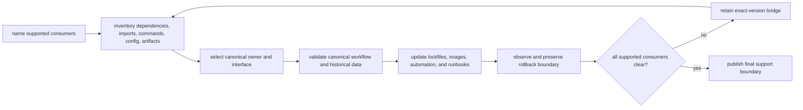

# Compatibility Migration

Migration moves a supported consumer from a preserved distribution, import,
or command to its canonical `bijux-canon-*` owner without losing runtime
behavior, configuration meaning, artifact access, or rollback safety. The
compatibility bridge remains active until every consumer-owned surface has
crossed that boundary and been validated in its real environment.

## Migration Lifecycle

```mermaid
flowchart LR
    inventory["name supported consumers"]
    surfaces["inventory dependencies, imports, commands, config, artifacts"]
    target["select canonical owner and interface"]
    validate["validate canonical workflow and historical data"]
    deploy["update lockfiles, images, automation, and runbooks"]
    observe["observe and preserve rollback boundary"]
    retire{"all supported consumers clear?"}
    keep["retain exact-version bridge"]
    close["publish final support boundary"]

    inventory --> surfaces --> target --> validate --> deploy --> observe --> retire
    retire -->|"no"| keep
    keep --> surfaces
    retire -->|"yes"| close
```

The bridge provides continuity during this path. It does not make partial
migration invisible: bridge imports, canonical imports, old command strings,
and new artifact readers can coexist in one application and still encode
conflicting identity assumptions.

## Choose by Current Need

| Situation | Use |
| --- | --- |
| the old name is known but its replacement is not | [Canonical targets](canonical-targets.md) |
| a consumer must be inventoried and changed safely | [Migration guidance](migration-guidance.md) |
| the dependency solver sees bridge/canonical conflicts | [Dependency continuity](dependency-continuity.md) |
| links or ownership still point to a retired repository | [Repository consolidation](repository-consolidation.md) |
| a bridge build or release candidate needs proof | [Validation strategy](validation-strategy.md) |
| availability of a bridge version must be established | [Release policy](release-policy.md) |
| supported usage may be gone | [Retirement conditions](retirement-conditions.md) |
| closure has been approved and must be executed | [Retirement playbook](retirement-playbook.md) |

## Consumer Migration Record

Keep one record per supported environment or application:

| Field | Required evidence |
| --- | --- |
| owner and environment | accountable team, deployment, Python version, and package source |
| preserved surface | distribution, root/deep import, console or module command, configuration, plugin entrypoint, artifact reader |
| canonical destination | package, import, interface, and target version |
| data boundary | caches, indexes, traces, manifests, databases, and retained historical artifacts |
| validation | install, import identity, representative workflow, error path, and artifact-read result |
| rollout | lockfile/image digest, deployment result, monitoring window, and rollback artifact |
| completion | confirmation that no supported runtime or recovery path requires the bridge |

A repository-wide name search can populate the record, but it cannot close it.
External lockfiles, notebooks, workflow variables, container layers, service
units, plugin strings, and disaster-recovery images may preserve an identity
that the source repository does not contain.

## Canonical Cutover Sequence

1. Align the compatibility distribution and canonical owner on one version.
2. Capture a representative success, expected failure, and retained artifact
   under the preserved identity.
3. Change dependency and lockfile records to the canonical distribution.
4. Change root and nested imports, including string-based plugin entrypoints.
5. Move console and `python -m` automation to the canonical interface.
6. Update configuration names, container probes, operational paths, and
   recovery commands.
7. Read historical artifacts and run the same acceptance cases under the
   canonical identity.
8. Deploy with an explicit rollback image or lockfile and observe the actual
   workload before removing the bridge from support inventory.

For `bijux-vex`, the command step requires interface redesign: the canonical
index distribution has no renamed console script. Select its typed Python API
or HTTP surface and validate the new request, refusal, and provenance contract.

## Completion Boundary

Migration is complete for one consumer only when:

- its environment resolves no compatibility distribution;
- its runtime imports no preserved root or aliased submodule;
- its commands and entrypoint strings invoke a canonical interface;
- its configuration, cache namespaces, and artifact readers use canonical
  identities;
- representative historical state remains readable or has a governed
  conversion and rollback path; and
- its deployment and recovery images have passed the canonical workflow.

Retirement is a separate package-family decision. It requires the completion
records of every supported consumer, a final release and notice policy, and a
coherent removal of source, release, test, and inventory surfaces.
