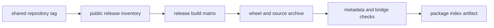

# Release Policy

Compatibility distributions share the repository release version with their
canonical owners, but version alignment, release eligibility, build selection,
and publication are different facts. A trustworthy release claim identifies
which of those facts has evidence.

## Release Evidence Chain

| Layer | What it establishes | What it does not establish |
| --- | --- | --- |
| shared VCS tag | canonical and compatibility sources resolve one version | that every distribution was selected or uploaded |
| public release inventory | distribution is eligible for public release checks | that a release workflow builds it |
| release build matrix | workflow is configured to build an artifact | that the run succeeded or publication occurred |
| built wheel and source archive | artifact contents and metadata can be inspected | that a package index serves them |
| publication record | a named artifact is available from a channel | that imports, commands, or consumer behavior pass |

## Current Repository Declaration

The workspace public-release inventory contains five canonical product
packages and all six compatibility distributions. `bijux-canon-dev` is an
internal support package and is excluded.

The generated release-build matrix currently selects these compatibility
distributions:

- `agentic-flows`
- `bijux-agent`
- `bijux-rag`
- `bijux-rar`
- `bijux-vex`

`bijux-canon` is declared public and buildable in the workspace but is not
currently enumerated in that generated release-build matrix. Consequently,
neither the shared version nor public eligibility is evidence that a matching
`bijux-canon` artifact was built or published. Check the target package index
and the release run before promising availability.

## Acceptance For A Compatibility Artifact

A release candidate is acceptable when:

1. built metadata requires the canonical distribution at the identical
   version;
2. wheel and source archive contain the alias package, `py.typed`, README,
   changelog, license, notice, and bridge implementation;
3. the installed root and representative nested imports preserve canonical
   object identity;
4. the preserved console script and `python -m` route reach the canonical CLI;
5. project URLs and package documentation identify the canonical owner; and
6. release notes describe continuity changes without assigning product
   behavior to the bridge.

The canonical package owns behavior testing. Compatibility validation remains
focused on packaging, identity, and delegation so two implementations cannot
quietly emerge.

## Publication Claims

Name the distribution, version, channel, and artifact when reporting a release.
“Bijux Canon released `X`” is insufficient evidence that every compatibility
distribution exists at `X`. For environments that need a preserved name,
resolve or inspect that exact distribution before updating the lockfile.

See [dependency continuity](dependency-continuity.md) for the exact-pin contract
and [validation strategy](validation-strategy.md) for executable acceptance
checks.
