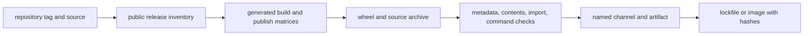

# Compatibility Release Policy

Compatibility distributions share the repository's VCS-derived version with
their canonical owners. Version alignment, public-release eligibility, build
selection, artifact verification, and publication are separate facts. A
release claim is trustworthy only when it names the distribution, version,
channel, and evidence available at each boundary.

## Release Evidence Chain

| Boundary | Establishes | Does not establish |
| --- | --- | --- |
| repository tag | one source version for canonical and compatibility packages | selection or upload of any distribution |
| public release inventory | package is governed as a public distribution | presence in every channel matrix |
| build matrix | workflow intends to build the named package | successful build, verification, or publication |
| wheel and source archive | inspectable files and resolved metadata exist | availability from PyPI, GHCR, or GitHub Releases |
| verification evidence | tested exact pin, contents, import identity, and dispatch | that a consumer's private imports or artifacts are compatible |
| publication record | named artifact is available from a named channel | that a resolver or deployment selected it |
| lockfile or image digest | consumer selected exact bytes | runtime acceptance without a representative workflow |

## Current Release Inventory

The root public-release inventory contains five canonical product packages and
all six compatibility distributions. `bijux-canon-dev` is internal support and
is excluded from public release.

The generated release build matrix currently selects these compatibility
packages:

- `agentic-flows`;
- `bijux-agent`;
- `bijux-rag`;
- `bijux-rar`; and
- `bijux-vex`.

`bijux-canon` is public, workspace-managed, and buildable, but it is not
currently listed in that generated release build matrix. Therefore the shared
tag, workspace inventory, and successful local build do not establish that a
matching `bijux-canon` artifact was produced or published. Check the release
run and target channel before promising its availability.

This is an explicit release-selection gap, not a reason to infer that the
bridge has been retired. Retirement requires the independent consumer evidence
defined by [retirement conditions](retirement-conditions.md).

## Artifact Acceptance

A compatibility release candidate is acceptable only when:

1. wheel and source-archive metadata require the canonical owner at the
   identical version;
2. both archives contain the forwarding package, `runtime_alias.py`,
   `__main__.py`, `py.typed`, README, overview, changelog, license, and notice;
3. an isolated installation resolves the matching canonical artifact;
4. root exports and representative nested imports preserve canonical object
   identity while bridge-local modules remain local;
5. the preserved console script and `python -m` route dispatch the canonical
   command and retain exit semantics;
6. expected canonical exceptions pass through without compatibility-specific
   reinterpretation;
7. project URLs identify the current repository, canonical handbook,
   compatibility record, migration guide, and security path; and
8. release notes describe continuity changes without assigning product
   behavior to the bridge.

Canonical package tests own algorithms, schemas, and operational behavior.
Bridge validation owns packaging, identity, and delegation. Duplicating the
product implementation or its complete suite under the old name would create a
second authority rather than stronger compatibility.

## Publication Decisions

For every channel, record:

| Field | Example meaning |
| --- | --- |
| distribution | `bijux-rag`, not the repository family in general |
| version | exact normalized package version |
| source reference | repository tag and commit used for the build |
| artifact | wheel/source archive name and digest, or container reference and digest |
| canonical pair | owner artifact and identical version |
| channel | PyPI, TestPyPI, GHCR, or GitHub Release |
| workflow evidence | run identity and successful package-specific job |
| consumer evidence | lockfile, image digest, or resolver result selecting the artifact |

“Bijux Canon version `X` was released” cannot establish that every compatibility
distribution exists at `X`. Verify each preserved distribution required by an
environment before updating its lockfile or rollback image.

## Failed or Partial Releases

If a bridge artifact publishes but its matching canonical artifact does not,
the exact dependency should make fresh resolution fail. Preserve that failure;
do not widen metadata or republish altered bytes under the same version.

If canonical publication succeeds but the bridge fails, canonical consumers
may proceed while preserved-name consumers remain on the last verified pair.
Repair the release configuration or source and publish a new repository
version. Package-index immutability and consumer provenance are more important
than forcing version symmetry after the fact.

Use [dependency continuity](dependency-continuity.md) for resolver behavior and
[validation strategy](validation-strategy.md) for the executable proof chain.
