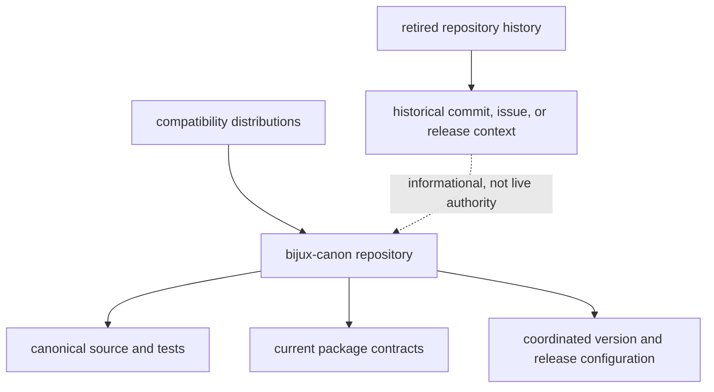

# Repository Consolidation

Current development, packaging, issue tracking, documentation, and release
coordination for the package family live in
[`bijux/bijux-canon`](https://github.com/bijux/bijux-canon). Earlier standalone
repositories remain historical references; they are not current implementation
owners and must not be used as live dependency or documentation authorities.

## Ownership Map

| Historical repository or family identity | Canonical package | Current handbook |
| --- | --- | --- |
| `bijux/agentic-flows` | `bijux-canon-runtime` | [Runtime](../../06-bijux-canon-runtime/index.md) |
| `bijux/bijux-agent` | `bijux-canon-agent` | [Agent](../../05-bijux-canon-agent/index.md) |
| `bijux/bijux-rag` | `bijux-canon-ingest` | [Ingest](../../02-bijux-canon-ingest/index.md) |
| `bijux/bijux-rar` | `bijux-canon-reason` | [Reason](../../04-bijux-canon-reason/index.md) |
| `bijux/bijux-vex` | `bijux-canon-index` | [Index](../../03-bijux-canon-index/index.md) |

`bijux-canon` is a compatibility distribution for runtime, but it is not a
retired standalone repository in this map. The current repository itself uses
the `bijux-canon` family name.

## Authority After Consolidation

Use an earlier repository only when the question is historical: which commit
introduced an old artifact, what a retired release contained, or which issue
explains a legacy consumer. Use the current repository for behavior, security,
schemas, support, fixes, and release decisions.

## Consumer Changes

Consolidation affects more than Git remotes. Inventory and replace:

| Surface | Move to |
| --- | --- |
| source or VCS dependency | canonical distribution release, or an explicit current repository reference when source installation is required |
| Python import | canonical package root and supported public modules |
| console or module command | canonical command; replace `bijux-vex` with `bijux-canon-index` |
| documentation and API links | `https://bijux.io/bijux-canon/` and the owning package section |
| issue and security reporting | current repository issue and security surfaces |
| container source and labels | current repository and canonical distribution identity |
| changelog or release link | current repository tag plus the named distribution artifact |
| artifact reader | canonical reader with explicit schema and historical-data validation |

Do not rewrite historical evidence to hide its original URL or package name.
An old manifest or incident record should retain the identity it actually used,
with a current canonical mapping added alongside it when needed.

## Release Consequences

The repository uses one VCS-derived version line for public packages, but every
distribution is built and published separately. A repository tag can establish
shared source versioning; it cannot establish that all compatibility and
canonical artifacts reached PyPI, GHCR, or a GitHub release.

For a consumer that retains a compatibility distribution, verify both bridge
and canonical artifacts at the same version and retain their hashes. For a
consumer that has migrated, verify the canonical artifact and confirm that its
lockfile, image, and recovery media no longer install the bridge.

## Historical Artifact Custody

Artifacts created before consolidation may contain retired import paths,
package names, repository URLs, entrypoint strings, or schema identifiers.
Forwarding imports do not rewrite those bytes. Preserve the original, identify
the canonical reader, and test load, replay, or conversion before removing the
bridge from recovery environments.

If conversion is required, write a new artifact with a new identity and retain
the source artifact plus conversion evidence. Repository consolidation changes
ownership; it does not justify silently relabeling historical state.

Continue with [canonical targets](canonical-targets.md) for exact interface
destinations and [migration guidance](migration-guidance.md) for consumer
cutover.
