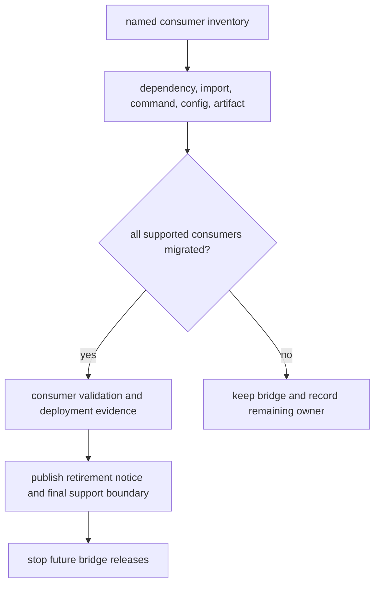

# Retirement Conditions

A compatibility distribution can stop receiving releases only after every
supported consumer has left every preserved surface it uses. A clean search in
this repository is useful internal evidence, but it cannot establish the state
of external applications, deployment images, notebooks, or automation.

## Decision Model

## Required Evidence

| Surface | Evidence before retirement |
| --- | --- |
| distribution | dependency manifests and lockfiles use the canonical package in every supported environment |
| root and nested imports | source, generated configuration, plugin paths, and type-checking pass with canonical imports |
| console command | scripts, workflows, images, service units, and runbooks use the canonical integration |
| module execution | no supported caller relies on `python -m <preserved_root>` |
| configuration | environment variables, entrypoint strings, and integration configuration have a canonical owner |
| stored artifacts | representative retained records remain readable or have an explicit conversion and rollback path |
| operations | deployed versions and rollback images no longer require the bridge |
| documentation | installation and recovery guidance no longer directs users to the preserved identity |

For `bijux-vex`, command retirement additionally requires a deployed Python or
HTTP index integration because no `bijux-canon-index` executable exists. For
`bijux-rar`, the continued availability of the `bijux-rar` command from the
canonical reason distribution does not prove that the old distribution and
Python import are unused.

## Evidence That Is Insufficient Alone

- no legacy-name matches in the monorepo;
- a green canonical package test suite;
- successful installation of the canonical distribution;
- low or unavailable package-index download counts;
- elapsed time since migration guidance was published; or
- the absence of a recently reported compatibility issue.

Each signal omits consumer identity or an exercised boundary. Pair repository
searches with named owners and validation from the environments the project
still supports.

## Retirement Record

Record the canonical replacement, last supported bridge version, affected
surfaces, known consumers, validation evidence, notice location, final release
date, and rollback boundary. Existing published artifacts may remain available
even after new releases stop; state that policy explicitly so “retired” is not
mistaken for “all historical artifacts were removed.”

Source removal, workspace-inventory removal, release-matrix removal, and
publication cessation are separate changes. Keep the repository coherent at
each commit and do not remove migration guidance while users of historical
artifacts may still encounter the old identity.

## When Evidence Is Incomplete

Retain the bridge and identify the missing consumer or proof owner. The bridge
is safer than an unverified removal as long as it remains a thin exact-version
delegate and does not acquire product behavior.

Use [migration guidance](migration-guidance.md) to move each consumer and
[release policy](release-policy.md) to distinguish the last built artifact from
the last published artifact.
