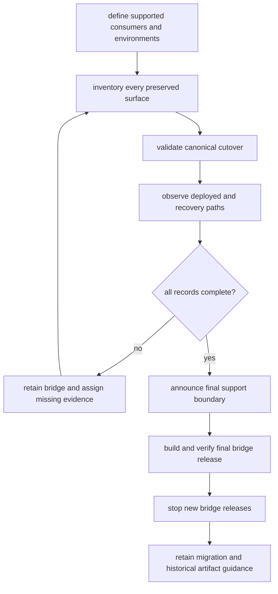

# Retirement Conditions

A compatibility distribution may stop receiving releases only when every
supported consumer has left every preserved surface it uses. Retirement is an
evidence decision about dependencies, imports, commands, configuration,
artifacts, deployments, and recovery—not a judgment based on bridge age or
repository search alone.

## Decision Path

No later action may compensate for an incomplete earlier one. A retirement
notice cannot replace consumer validation, and a final release cannot establish
that recovery images no longer need the old identity.

## Required Consumer Evidence

| Surface | Evidence before retirement |
| --- | --- |
| distribution | manifests and lockfiles resolve the canonical package in every supported environment |
| root and nested imports | source, generated code, notebooks, type checking, and plugin strings use canonical modules |
| console command | scripts, workflows, images, service units, monitoring, and runbooks use a canonical interface |
| module execution | no supported caller relies on `python -m <preserved_root>` |
| configuration | environment variables, entrypoint strings, cache namespaces, and integration configuration have canonical ownership |
| stored state | representative caches, indexes, traces, manifests, and databases remain readable or have a governed conversion and rollback path |
| deployment | active images, scheduled jobs, and rollback media no longer install the bridge |
| operations | incident, restore, replay, and disaster-recovery procedures pass without the bridge |
| communication | installation, security, support, and recovery guidance names the canonical owner and final bridge boundary |

Every record needs a named consumer, accountable owner, environment, canonical
version, validation result, deployment evidence, and rollback boundary. An
unknown consumer is not a completed record.

Repository automation currently validates the six bridge implementations and
their publication contracts; it does not maintain a machine-readable inventory
of external consumers or observe their deployments. A green repository suite
therefore proves that a bridge remains coherent enough to retain or release. It
is never, by itself, authorization to retire one.

Consumer evidence also needs a declared observation window. Record when the
deployment and recovery paths were last exercised, which immutable image,
lockfile, and artifact digests were observed, and when the owner requires
revalidation. Evidence that predates a supported deployment change is stale
until that environment is exercised again.

## Package-Specific Gates

- `bijux-canon` and `agentic-flows` share `bijux-canon-runtime` as owner.
  Retiring one bridge does not establish that consumers of the other have moved.
- `bijux-vex` has no same-spelling canonical console replacement. Every command
  consumer must move to the index Python or HTTP interface and validate its
  request, refusal, result, and provenance handling.
- `bijux-rar` command availability can come from the canonical reason package.
  A successful `bijux-rar` invocation does not prove that the compatibility
  distribution or `bijux_rar` import has disappeared.
- Artifact-heavy ingest, index, reason, and runtime consumers must exercise
  historical reads. Import migration cannot establish serialized compatibility.

## Insufficient Evidence

None of these signals is sufficient by itself:

- no preserved-name matches in this repository;
- a green canonical package suite;
- successful installation of a canonical wheel;
- low or unavailable package-index download counts;
- elapsed time since migration guidance was published;
- absence of recent compatibility issues; or
- one production environment completing a canonical workflow.

Each omits either consumer scope or an exercised boundary. Combine repository
evidence with named environment owners, lockfile and image inspection,
representative workflows, historical artifact checks, and recovery validation.

## Retirement Record

The decision record contains:

1. preserved distribution, import root, commands, and canonical owner;
2. final supported bridge version and canonical version;
3. supported consumer inventory with completion evidence;
4. unresolved or explicitly unsupported consumers;
5. notice location, communication date, and support boundary;
6. final build, metadata, import, command, and publication evidence;
7. source, workspace, automation, and release surfaces to remove;
8. historical artifact availability and documentation policy; and
9. rollback and incident-response procedure after release cessation.

The aggregate record must also state who approved the supported-consumer scope
and how unknown consumers were handled. Excluding an environment is a support
decision that requires explicit ownership and communication; silently omitting
it from the inventory does not convert it into completed evidence.

Published files may remain downloadable after new releases stop. State that
separately from source removal and support cessation so “retired” is not
misread as “all historical artifacts were deleted.”

## Decision Outcomes

| Evidence state | Outcome |
| --- | --- |
| supported consumer still uses a preserved surface | retain and test the bridge |
| consumer ownership is unknown | retain the bridge and assign the inventory gap |
| canonical cutover works but rollback still installs the bridge | retain until recovery evidence is canonical |
| all consumer records complete but no notice/final release exists | prepare retirement; do not stop releases yet |
| all records, notice, final artifact, and rollback evidence complete | execute the [retirement playbook](retirement-playbook.md) |

Keeping a verified thin bridge is safer than unproven removal. Keeping it
without an owner, migration record, or tests is not a retirement strategy.
