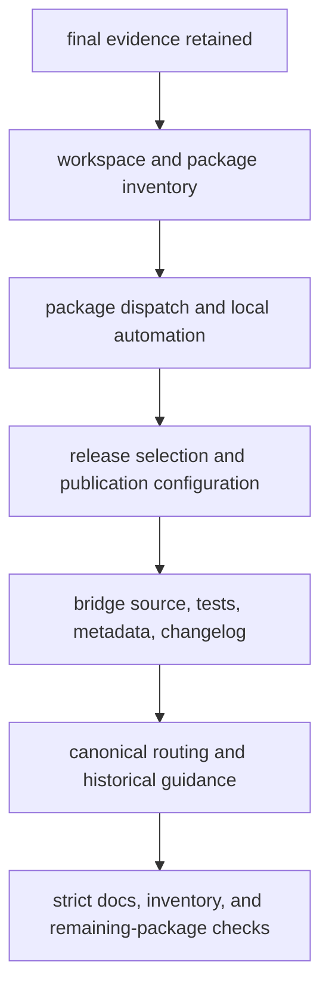
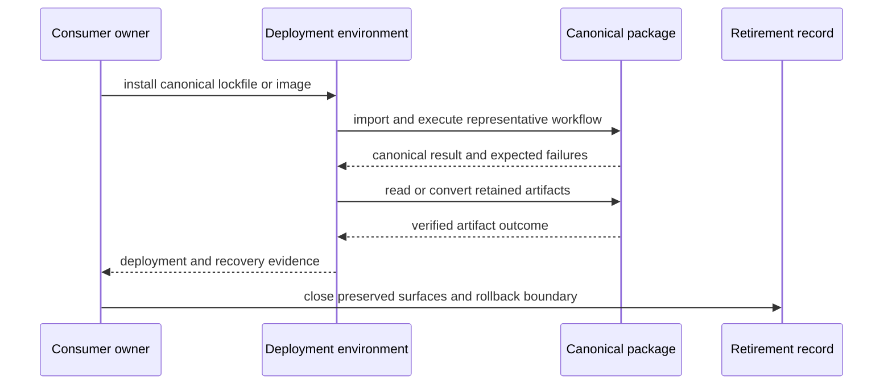

# Retirement Playbook

Use this playbook after the retirement decision record satisfies every
[retirement condition](retirement-conditions.md). It stops future bridge
releases while preserving historical evidence, canonical routing, and a
recoverable boundary for already-published artifacts.

## Preconditions

Do not begin source removal until all of these are available:

- approved supported-consumer inventory;
- canonical validation and deployment evidence for each consumer;
- historical artifact-read or conversion evidence;
- announced final bridge version and support boundary;
- verified final wheel and source archive;
- package-index and container retention decision;
- rollback and incident-response record; and
- named owner for post-retirement questions.

If any item is missing, keep the bridge releasable and return to consumer
migration. Repository tidiness does not justify a broken recovery path.

## Preserve the Final Evidence Set

Before changing repository inventory, retain:

| Evidence | Purpose |
| --- | --- |
| final bridge wheel and source archive with hashes | reconstruct the published compatibility boundary |
| matching canonical artifacts with hashes | prove the exact-version implementation pair |
| built metadata | retain the canonical dependency and preserved console target |
| import and command test output | show the final delegated surfaces |
| consumer completion records | establish why release continuity can stop |
| notice and release notes | establish the communicated support boundary |
| historical artifact fixtures | preserve read, replay, or conversion evidence |
| package-index and container references | distinguish retained downloads from active support |

Store this evidence in the release and governance systems that own it. Do not
rely on a local build directory or an editable checkout as the only record.

## Repository Change Boundaries

Apply repository changes in reviewable ownership groups:

1. remove the bridge from root package inventories, local dependency groups,
   workspace source mappings, package-directory mappings, and package dispatch;
2. update release and publication selection through their owning configuration
   and regenerate managed workflow output rather than hand-editing synchronized
   files;
3. remove bridge source, package-local tests, build metadata, and release
   entries only after no active configuration references their paths;
4. update compatibility maps to mark the final version and canonical owner;
5. retain migration, artifact, and retired-repository guidance needed by users
   of historical files; and
6. validate the remaining package family from a clean environment.

Source removal, release cessation, package-index retention, and documentation
retention are separate decisions. Keep each one explicit in commit and release
history.

## Consumer Cutover Verification

For every supported consumer, confirm after the final bridge release:

Verify normal operation, at least one expected failure, restart or recovery,
and the oldest retained artifact still covered by policy. Confirm that rollback
uses a known image or lockfile; do not reconstruct it by reinstalling an
unbounded package name after retirement.

## Package-Specific Execution

- For `bijux-vex`, retain the verified `bijux-canon-index`, Python, or HTTP
  invocation and its provenance handling.
- For `bijux-rar`, inspect installed distributions and imports rather than
  treating the still-available command as bridge evidence.
- For `bijux-canon` and `agentic-flows`, verify that removing one exact pin does
  not disturb consumers that intentionally retain the other runtime bridge.

## Post-Retirement Validation

After repository and release configuration changes:

- resolve and install every remaining public package;
- prove no workspace, Make dispatch, release matrix, publication contract, or
  documentation link expects the removed package directory;
- build the documentation strictly and verify canonical migration routes;
- search for the preserved name and classify remaining matches as historical,
  migration, retained artifact, or defect;
- verify package-index and container retention match the published policy; and
- exercise the incident path for a user who still holds the final bridge
  artifact.

Do not erase all preserved-name matches. Changelogs, historical artifacts,
retired repository mappings, and final support records must continue to name
the identity they describe.

## Reopen Criteria

If a supported consumer or recovery path is discovered after release
cessation, record the missed surface and determine whether the final published
bridge already covers it. Reissuing a bridge is a release decision requiring a
matching canonical version and the complete validation chain; it must not be
performed by widening old dependency metadata or restoring an untested source
snapshot.

Retirement is complete when new bridge releases have stopped through governed
configuration, supported consumers operate and recover canonically, historical
evidence remains interpretable, and the repository has no active dependency on
the removed implementation path.
