# Compatibility Validation

Compatibility validation proves that a preserved identity delegates to one
canonical implementation from source declaration through installed behavior.
It also proves migration readiness by exercising the same canonical surface a
consumer will use after the bridge is removed.

## Proof Stack

```mermaid
flowchart LR
    inventory["workspace mapping"]
    source["bridge layout and metadata hook"]
    build["wheel and source archive"]
    install["isolated same-version pair"]
    imports["root and nested module identity"]
    commands["console and python -m dispatch"]
    behavior["canonical success and failure"]
    consumer["canonical consumer workflow"]

    inventory --> source --> build --> install --> imports --> commands --> behavior --> consumer
```



Each layer catches a different class of defect. An import from a checkout
cannot validate built dependencies; archive inspection cannot validate command
dispatch; a help command cannot validate nested-module identity; and bridge
tests cannot prove a consumer's historical artifacts remain readable.

## Package Mapping

| Bridge source directory | Distribution | Preserved root | Canonical owner |
| --- | --- | --- | --- |
| `compat-bijux-canon` | `bijux-canon` | `bijux_canon` | `bijux-canon-runtime` |
| `compat-agentic-flows` | `agentic-flows` | `agentic_flows` | `bijux-canon-runtime` |
| `compat-bijux-agent` | `bijux-agent` | `bijux_agent` | `bijux-canon-agent` |
| `compat-bijux-rag` | `bijux-rag` | `bijux_rag` | `bijux-canon-ingest` |
| `compat-bijux-rar` | `bijux-rar` | `bijux_rar` | `bijux-canon-reason` |
| `compat-bijux-vex` | `bijux-vex` | `bijux_vex` | `bijux-canon-index` |

## Repository Contract Checks

From the repository root, run the focused compatibility contracts:

```bash
.tox/test-dev/bin/python -m pytest \
  packages/bijux-canon-dev/tests/test_compat_package_contract.py \
  packages/bijux-canon-dev/tests/test_publish_metadata.py \
  -k 'compatibility or legacy_continuity' \
  --basetemp=artifacts/compat-validation/pytest -q
```

These checks validate workspace inventory, required bridge files, forwarding
machinery, canonical entrypoint imports, distribution metadata, project URLs,
README routing, exact dependency-hook source, and console targets. They are
source and publication-contract evidence; they do not replace built-wheel
installation.

Run the package-local bridge test for the package being changed. For example:

```bash
.tox/test-dev/bin/python -m pytest \
  packages/compat-bijux-rag/tests/unit/test_bijux_rag_compatibility_bridge.py \
  --basetemp=artifacts/compat-validation/pytest-bijux-rag -q
```

Package-local tests load the bridge and canonical source trees directly. They
check selected root exports and representative nested-module identity; the two
runtime bridges also check lazy root import behavior. The repository contract
inspects the declared console target and `__main__` forwarding source. Neither
layer executes an installed console script, so command dispatch remains a
built-artifact test.

## Automated Coverage Boundary

The checked-in gates intentionally stop at the repository boundary:

| Evidence layer | Automated here | Not established by that layer |
| --- | --- | --- |
| repository contract | workspace inventory, required bridge files, alias-helper source shape, entrypoint declaration, metadata and documentation routing | import behavior of a built wheel |
| package-local unit test | selected root exports and representative source-tree alias identity | arbitrary private modules, installed metadata, resolver behavior, or console subprocess behavior |
| release artifact configuration tests | declared wheel/source-archive inclusion and publication metadata policy | actual archive contents or co-installation with a real canonical wheel pair |
| isolated install | performed by the release or migration operator | consumer configuration, stored-state compatibility, and deployed recovery |

This boundary is deliberate: exhaustive aliasing cannot be inferred from one
representative nested import, and source-path injection can conceal a missing
wheel file or dependency. Record source-test success as bridge implementation
evidence, not installation evidence.

## Build and Install Evidence

Use the compatibility package build profile so the canonical source mapping,
metadata hook, archive contents, and package data follow the same path as a
release candidate. Direct all build evidence to the package's `artifacts/`
location.

Inspect both wheel and source archive for:

- distribution name and normalized version;
- exact canonical dependency;
- preserved console script target;
- `__init__.py`, `runtime_alias.py`, `__main__.py`, and `py.typed`;
- README, overview, changelog, license, and notice; and
- current repository, handbook, migration, and security URLs.

Install the bridge and canonical wheels into a fresh environment without
workspace or editable sources. Run `python -m pip check`, inspect installed
versions, import the preserved and canonical roots, and execute the preserved
console and module routes. Retain artifact hashes and resolver output.

## Import and Command Assertions

For each bridge, prove:

| Assertion | Expected result |
| --- | --- |
| root import | exposes canonical public attributes and version |
| representative product submodule | preserved and canonical names resolve to the same module object |
| `runtime_alias` and `__main__` | remain bridge-local infrastructure |
| unknown/private import | fails or remains unsupported rather than creating copied behavior |
| console `--help` | reaches the canonical command under the preserved executable name |
| `python -m <preserved_root>` | follows the same canonical dispatcher |
| invalid arguments or expected domain failure | canonical exit status and error meaning pass through unchanged |

For `bijux-vex`, test the preserved command even though the canonical index
distribution has no renamed console script. For `bijux-rar`, inspect installed
distributions because the command can also be registered by the canonical
reason package.

## Consumer Migration Evidence

After bridge continuity passes, validate the consumer directly against the
canonical owner:

1. replace the dependency and regenerate the lockfile;
2. replace root, nested, and string-based imports;
3. replace console and module invocations with a canonical interface;
4. load representative historical caches, indexes, traces, manifests, or
   databases;
5. run one normal workflow and one expected failure;
6. build and deploy the canonical image or environment; and
7. exercise restart, rollback, and recovery without the bridge installed.

The bridge test and canonical consumer test answer different questions. The
first proves continuity during migration; the second proves the bridge can
eventually be removed.

## Classify Remaining Names

Search dependency files, source, generated configuration, workflows,
deployment definitions, images, notebooks, plugins, and runbooks. Classify
each match as:

- supported consumer dependency;
- active internal dependency;
- compatibility implementation or contract test;
- historical artifact, changelog, or retired-repository evidence;
- migration guidance; or
- stale use to remove.

A raw match count is not retirement evidence. Record the owner, environment,
surface, canonical destination, and removal condition for active consumer and
internal dependencies.

## Acceptance Outcomes

| Outcome | Interpretation |
| --- | --- |
| source contracts pass, build/install not run | repository delegation is coherent; release candidate is not yet proven |
| wheel installs, import identity fails | bridge packaging or alias defect; do not publish |
| imports pass, command differs | entrypoint continuity defect; do not publish |
| bridge passes, canonical consumer fails | migration or canonical compatibility gap; retain bridge and investigate owner |
| all layers pass, supported consumers remain | release bridge and continue migration |
| all layers and consumer completion records pass | evaluate [retirement conditions](retirement-conditions.md) |

Retain exact commands, package versions, artifact hashes, environment identity,
and results with every verdict. A compatibility claim without the tested
surface and artifact pair is not reproducible.
