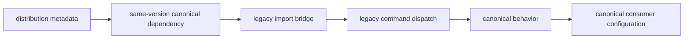

# Validation Strategy

Compatibility validation proves continuity and migration at the same time.
Legacy installs, imports, and commands must keep working for supported users,
while canonical packages remain the only owner of implementation behavior.

## Supported Mapping

| Legacy distribution | Legacy import | Canonical package |
| --- | --- | --- |
| `bijux-canon` | `bijux_canon` | `bijux-canon-runtime` |
| `agentic-flows` | `agentic_flows` | `bijux-canon-runtime` |
| `bijux-agent` | `bijux_agent` | `bijux-canon-agent` |
| `bijux-rag` | `bijux_rag` | `bijux-canon-ingest` |
| `bijux-rar` | `bijux_rar` | `bijux-canon-reason` |
| `bijux-vex` | `bijux_vex` | `bijux-canon-index` |

Each compatibility distribution installs the canonical distribution at the
same version. Its legacy module delegates public attributes to the canonical
runtime, and its `__main__` dispatches the canonical CLI while preserving the
legacy executable name.

## Proof Layers



### Publication metadata

Verify the legacy distribution name, canonical mapping in the Hatch metadata
hook, same-version dependency injection, Python support, console entrypoint,
project URLs, changelog, and package data. A wheel that imports locally but
declares the wrong dependency is not a valid compatibility release.

### Import bridge

Verify that the package contains `__init__.py`, `__main__.py`,
`runtime_alias.py`, and `py.typed`. The bridge must provide canonical public
attributes through `__getattr__` and `__dir__`; it must not copy canonical
implementations into the legacy namespace.

### Command bridge

Install the built compatibility wheel into an isolated environment and run the
legacy command's help or a side-effect-free contract action. Confirm that
arguments, exit semantics, and structured output come from the canonical CLI.

### Runtime behavior

Run the package-local bridge test against the installed distribution. Test a
small representative API surface, including error propagation. Avoid a large
duplicate suite: canonical behavior belongs to the canonical package tests,
while compatibility tests prove delegation.

### Documentation and navigation

Verify that the package README identifies its alias role, canonical owner,
install command, legacy executable, public API re-export, compatibility
contract, migration guide, handbook page, changelog, and any retired repository.
All published links must be absolute and usable from PyPI.

## Repository Checks

The focused repository contracts are:

```bash
pytest packages/bijux-canon-dev/tests/test_compat_package_contract.py
pytest packages/bijux-canon-dev/tests/test_publish_metadata.py \
  -k 'compatibility or legacy_continuity'
```

Package-local bridge tests live under each compatibility package's
`tests/unit/` directory. Build validation uses the compatibility package make
profile, which installs the mapped canonical source before lint and tests and
writes release evidence under that package's artifact directory.

## Detecting Unfinished Migration

Search consumer-owned dependency files, source, tests, workflows, deployment
configuration, and runbooks for legacy distributions, imports, and commands.
Exclude the compatibility packages, their catalog pages, migration history, and
tests that intentionally assert continuity.

A raw repository-wide count is not retirement evidence because it mixes active
usage with the compatibility implementation itself. Classify every match as:

- supported external dependency;
- active internal dependency;
- intentional compatibility declaration;
- historical or migration documentation; or
- stale usage to remove.

Track the owner and removal condition for the first two categories.

## Release Acceptance

A compatibility release is ready when:

- its canonical dependency is pinned to the identical version;
- both wheel and source archive contain the bridge and documentation files;
- the legacy import and command work from the built wheel;
- canonical exceptions and exits pass through without reinterpretation;
- metadata and published links identify the canonical owner; and
- no new internal consumer uses the legacy surface.

Retirement requires stronger evidence than a green compatibility build. Use
[Migration Guidance](migration-guidance.md) to move consumers and the retirement
criteria to decide when continuity is no longer required.
