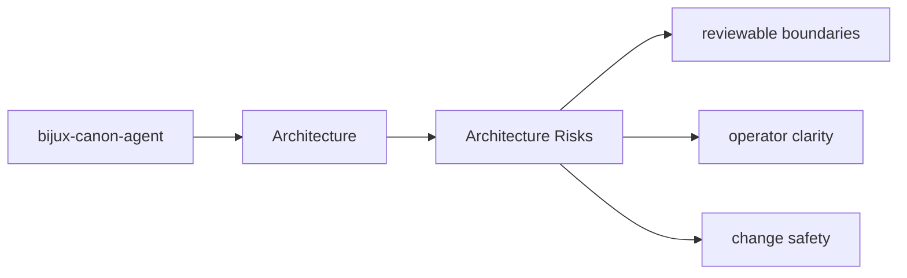
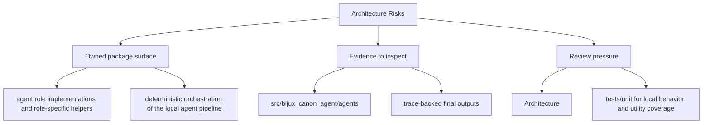

# Architecture Risks

Architectural risk appears when the package boundary becomes hard to explain or hard to test.

## Page Maps

## Risk Signals

- behavior moves into the wrong package because it seems convenient
- interfaces start depending on lower-level implementation details directly
- produced artifacts stop matching their documented contract

## Review Areas

- `src/bijux_canon_agent/agents` for role-local behavior
- `src/bijux_canon_agent/pipeline` for execution flow orchestration
- `src/bijux_canon_agent/application` for workflow policy and graph logic
- `src/bijux_canon_agent/llm` for LLM runtime integration support
- `src/bijux_canon_agent/interfaces` for CLI boundaries and operator helpers
- `src/bijux_canon_agent/traces` for trace-facing models and persistence helpers

## What This Page Answers

- how bijux-canon-agent is structured internally
- which modules control the main execution path
- where architectural drift would become visible first

## Purpose

This page keeps architectural review focused on durable package risks instead of transient churn.

## Stability

Keep it aligned with the package structure and known review concerns.
