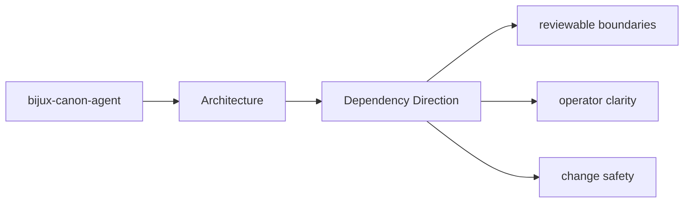

# Dependency Direction

The package should keep dependency direction readable: domain intent near the center,
interfaces and infrastructure at the edges.

## Page Maps

## Directional Reading Order

- domain and model concerns under the core module groups
- application orchestration that composes domain behavior
- interfaces, APIs, and adapters that sit at the boundary

## Concrete Anchors

- `src/bijux_canon_agent/agents` for role-local behavior
- `src/bijux_canon_agent/pipeline` for execution flow orchestration
- `src/bijux_canon_agent/application` for workflow policy and graph logic
- `src/bijux_canon_agent/llm` for LLM runtime integration support
- `src/bijux_canon_agent/interfaces` for CLI boundaries and operator helpers
- `src/bijux_canon_agent/traces` for trace-facing models and persistence helpers

## Purpose

This page makes dependency direction explicit enough to review during refactors.

## Stability

Keep it aligned with current imports and directory responsibilities.
