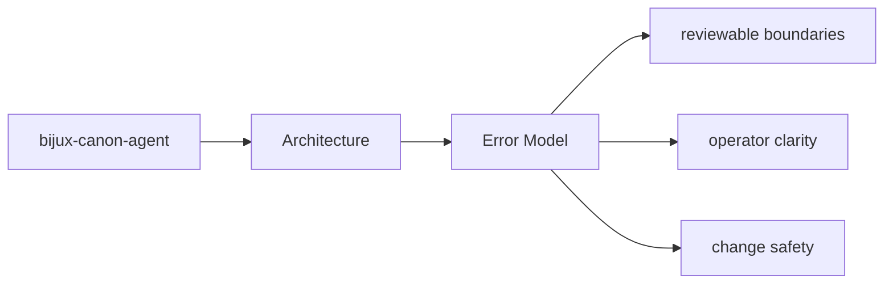
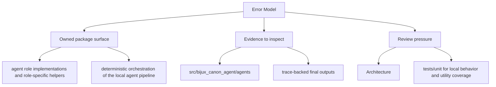

# Error Model

The package error model should make it clear which failures are local validation issues,
which are dependency failures, and which are contract violations.

## Page Maps

## Review Anchors

- inspect interface modules for operator-facing error shape
- inspect application and domain modules for orchestration failures
- inspect tests for the failure cases the package already protects

## Test Areas

- tests/unit for local behavior and utility coverage
- tests/integration and tests/e2e for end-to-end workflow behavior
- tests/invariants for package promises that should not drift
- tests/api for HTTP-facing validation

## Concrete Anchors

- `src/bijux_canon_agent/agents` for role-local behavior
- `src/bijux_canon_agent/pipeline` for execution flow orchestration
- `src/bijux_canon_agent/application` for workflow policy and graph logic

## Use This Page When

- you are tracing internal structure or execution flow
- you need to understand where modules fit before refactoring
- you are reviewing architectural drift instead of one local bug

## What This Page Answers

- how bijux-canon-agent is structured internally
- which modules control the main execution path
- where architectural drift would become visible first

## Reviewer Lens

- trace the claimed execution path through the listed modules
- look for dependency direction that now contradicts the documented seam
- verify that architectural risks still match the current code structure

## Honesty Boundary

This page describes the current structural model of bijux-canon-agent, but it does not by itself prove that every import or runtime path still obeys that model.

## Purpose

This page records how to reason about failures in architecture review.

## Stability

Keep it aligned with the actual error-handling behavior and tests.
