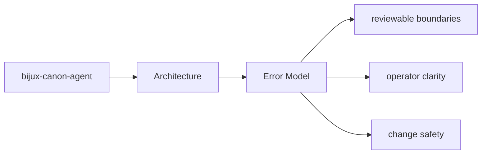
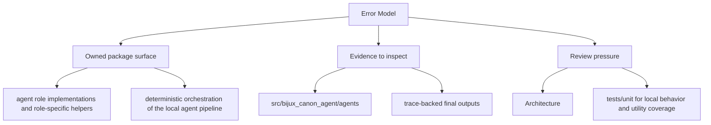

# Error Model

The package error model should make it clear which failures are local validation issues,
which are dependency failures, and which are contract violations.

Read the architecture pages for `bijux-canon-agent` as a reviewer-facing map of structure and flow: they should be detailed enough to shorten code reading without pretending to replace it.

## Page Maps

## Review Anchors

- inspect interface modules for operator-facing error shape
- inspect application and domain modules for orchestration failures
- inspect tests for the failure cases the package already protects

## Test Areas

- tests/unit for local behavior and utility coverage
- tests/integration and tests/e2e for end-to-end workflow behavior
- tests/invariants for package promises that should not drift
- tests/api for HTTP-facing validation

## Concrete Anchors

- `src/bijux_canon_agent/agents` for role-local behavior
- `src/bijux_canon_agent/pipeline` for execution flow orchestration
- `src/bijux_canon_agent/application` for workflow policy and graph logic

## Use This Page When

- you are tracing internal structure or execution flow
- you need to understand where modules fit before refactoring
- you are reviewing architectural drift instead of one local bug

## Decision Rule

Use `Error Model` to decide whether a structural change makes `bijux-canon-agent` easier or harder to explain in terms of modules, dependency direction, and execution flow. If the change only works because the architecture becomes less legible, the page should push the reviewer toward redesign rather than acceptance.

## Next Checks

- move to interfaces when the review reaches a public or operator-facing seam
- move to operations when the concern becomes repeatable runtime behavior
- move to quality when you need proof that the documented structure is still protected

## Update This Page When

- module responsibilities or dependency direction change materially
- new execution pathways or structural seams become important to review
- architectural risk shifts enough that the current map is misleading

## What This Page Answers

- how bijux-canon-agent is structured internally
- which modules control the main execution path
- where architectural drift would become visible first

## Reviewer Lens

- trace the claimed execution path through the listed modules
- look for dependency direction that now contradicts the documented seam
- verify that architectural risks still match the current code structure

## Honesty Boundary

This page describes the current structural model of bijux-canon-agent, but it does not by itself prove that every import or runtime path still obeys that model.

## Purpose

This page records how to reason about failures in architecture review.

## Stability

Keep it aligned with the actual error-handling behavior and tests.

## What Good Looks Like

- `Error Model` lets a reviewer trace structure without guessing where the real pathway lives
- the documented module relationships make refactors easier to reason about before code is changed
- the page shortens code reading by pointing at the right structural hotspots first

## Failure Signals

- `Error Model` points to modules that no longer carry the behavior the page claims they do
- dependency direction has to be explained with caveats instead of a clean structural story
- the path from interface to domain to proof no longer feels traceable in one pass

## Cross Implications

- changes here alter how interface, operations, and quality pages for `bijux-canon-agent` should be read
- structural drift often becomes visible in caller-facing seams before it is obvious in prose
- quality expectations need to move when the architecture adds new execution or dependency pressure

## Evidence Checklist

- open the listed structural modules in `packages/bijux-canon-agent/src/bijux_canon_agent` and trace whether they still match the page narrative
- inspect `packages/bijux-canon-agent/tests` for regressions that reveal changed execution or dependency structure
- compare the documented hotspots with the actual changed files in the review

## Anti-Patterns

- explaining structure with diagrams that no longer match the modules listed
- treating temporary implementation shortcuts as if they were enduring architectural seams
- allowing dependency direction to drift because the code still happens to run

## Escalate When

- the documented structure no longer matches the changed execution path
- a local refactor introduces a dependency direction question that affects other sections
- the review cannot explain the change without redefining a major seam

## Core Claim

The architectural claim of `bijux-canon-agent` is that its structure is deliberate enough for a reviewer to trace responsibilities, dependencies, and drift pressure without reverse-engineering the entire codebase.

## Why It Matters

If the architecture pages for `bijux-canon-agent` are weak, refactors become guesswork and dependency drift can hide until failures show up in tests or production-facing behavior.

## If It Drifts

- dependency direction becomes harder to inspect quickly
- refactors can land without anyone noticing structural regressions until later
- code navigation becomes slower because the documented map no longer matches reality

## Representative Scenario

A reviewer is tracing a refactor through `bijux-canon-agent` and needs to know whether the changed modules still line up with the documented execution and dependency structure.

## Source Of Truth Order

- `packages/bijux-canon-agent/src/bijux_canon_agent` for the actual dependency and module structure
- `packages/bijux-canon-agent/tests` for structural and behavioral regressions
- this page for the reviewer-facing map that should remain aligned with those assets

## Common Misreadings

- that the documented module map guarantees every import is still clean automatically
- that one current implementation path is the whole architecture contract
- that diagrams replace the need to inspect the concrete modules listed here
