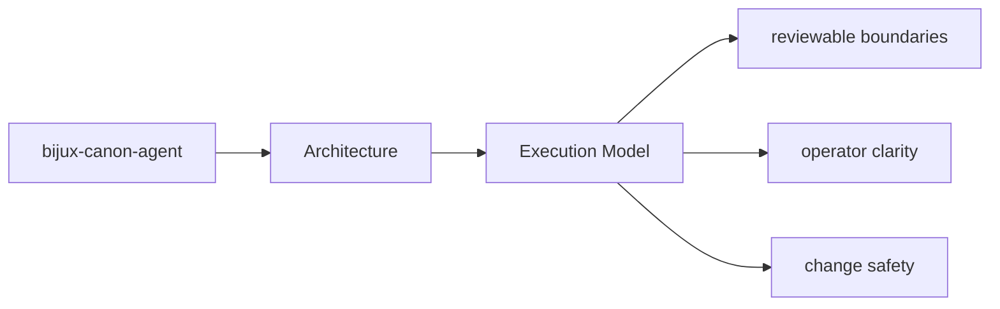

# Execution Model

`bijux-canon-agent` executes work by receiving inputs at its interfaces, coordinating policy
and workflows in application code, and delegating specific responsibilities to owned modules.

## Page Maps

## Execution Anchors

- entry surfaces: CLI entrypoint in src/bijux_canon_agent/interfaces/cli/entrypoint.py, operator configuration under src/bijux_canon_agent/config, HTTP-adjacent modules under src/bijux_canon_agent/api
- workflow modules: src/bijux_canon_agent/agents, src/bijux_canon_agent/pipeline, src/bijux_canon_agent/application
- outputs: trace-backed final outputs, workflow graph execution records, operator-visible result artifacts

## Purpose

This page summarizes the package execution model before readers inspect individual modules.

## Stability

Keep it aligned with the actual workflow code and entrypoints.
