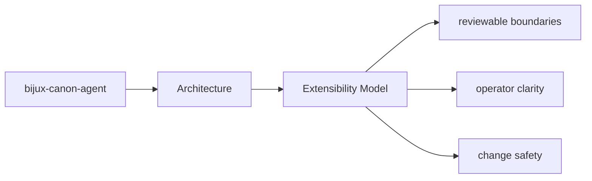

# Extensibility Model

Extension work should use the package seams that already exist instead of bypassing ownership.

## Page Maps

## Likely Extension Areas

- `src/bijux_canon_agent/agents` for role-local behavior
- `src/bijux_canon_agent/pipeline` for execution flow orchestration
- `src/bijux_canon_agent/application` for workflow policy and graph logic
- `src/bijux_canon_agent/llm` for LLM runtime integration support
- `src/bijux_canon_agent/interfaces` for CLI boundaries and operator helpers
- `src/bijux_canon_agent/traces` for trace-facing models and persistence helpers

## Extension Rule

Add extension points where the package already expects variation, and document them next to the owning boundary.

## Purpose

This page helps maintainers extend the package without smearing responsibilities together.

## Stability

Keep it aligned with the package seams that actually support extension today.
