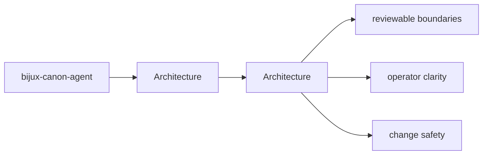
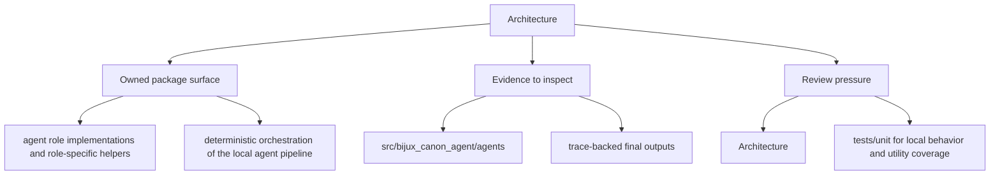

# Architecture

bijux-canon-agent architecture pages describe how modules and responsibilities fit together under `bijux_canon_agent`.

## Page Maps

## Pages in This Section

- [Module Map](module-map.md)
- [Dependency Direction](dependency-direction.md)
- [Execution Model](execution-model.md)
- [State and Persistence](state-and-persistence.md)
- [Integration Seams](integration-seams.md)
- [Error Model](error-model.md)
- [Extensibility Model](extensibility-model.md)
- [Code Navigation](code-navigation.md)
- [Architecture Risks](architecture-risks.md)

## Read Across the Package

- [Foundation](../foundation/index.md)
- [Interfaces](../interfaces/index.md)
- [Operations](../operations/index.md)
- [Quality](../quality/index.md)

## Use This Page When

- you are tracing internal structure or execution flow
- you need to understand where modules fit before refactoring
- you are reviewing architectural drift instead of one local bug

## What This Page Answers

- how bijux-canon-agent is structured internally
- which modules control the main execution path
- where architectural drift would become visible first

## Reviewer Lens

- trace the claimed execution path through the listed modules
- look for dependency direction that now contradicts the documented seam
- verify that architectural risks still match the current code structure

## Honesty Boundary

This page describes the current structural model of bijux-canon-agent, but it does not by itself prove that every import or runtime path still obeys that model.

## Section Contract

- define what the architecture section covers for bijux-canon-agent
- point readers to the topic pages that hold the detailed explanations
- keep the section boundary reviewable as the package evolves

## Reading Advice

- start here when you know the package but not yet the right page inside the section
- use the page list to choose the narrowest topic that matches the current question
- move across sections only after this section stops being the right lens

## Purpose

This page explains how to use the architecture section for `bijux-canon-agent` without repeating the detail that belongs on the topic pages beneath it.

## Stability

This page is part of the canonical package docs spine. Keep it aligned with the current package boundary and the topic pages in this section.
