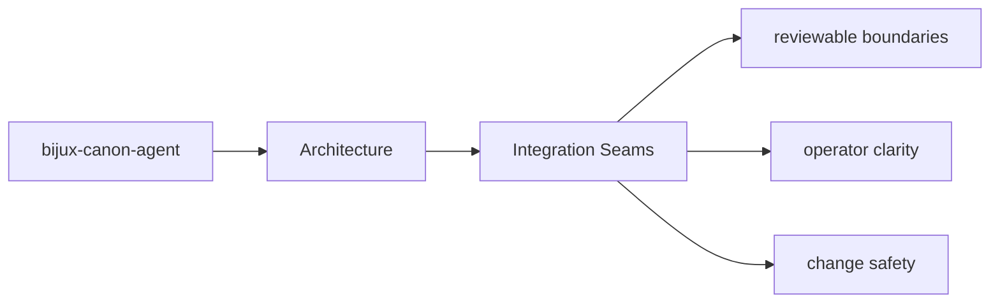
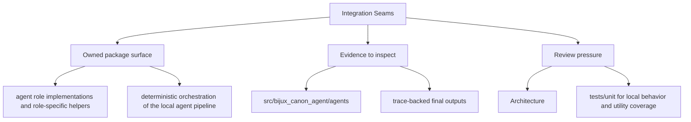

# Integration Seams

Integration seams are the points where `bijux-canon-agent` meets configuration, APIs,
operators, or neighboring packages.

## Page Maps

## Integration Surfaces

- CLI entrypoint in src/bijux_canon_agent/interfaces/cli/entrypoint.py
- operator configuration under src/bijux_canon_agent/config
- HTTP-adjacent modules under src/bijux_canon_agent/api

## Adjacent Systems

- coordinates work that may call ingest, reason, and runtime components
- leans on runtime for governed execution and replay acceptance

## Use This Page When

- you are tracing internal structure or execution flow
- you need to understand where modules fit before refactoring
- you are reviewing architectural drift instead of one local bug

## What This Page Answers

- how bijux-canon-agent is structured internally
- which modules control the main execution path
- where architectural drift would become visible first

## Reviewer Lens

- trace the claimed execution path through the listed modules
- look for dependency direction that now contradicts the documented seam
- verify that architectural risks still match the current code structure

## Honesty Boundary

This page describes the current structural model of bijux-canon-agent, but it does not by itself prove that every import or runtime path still obeys that model.

## Purpose

This page explains where to look when integration behavior changes.

## Stability

Keep it aligned with real boundary modules and schema files.
