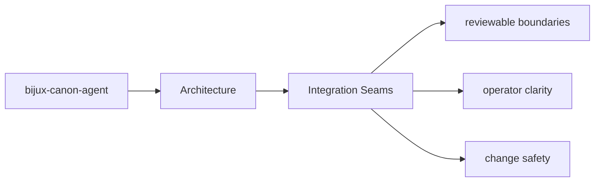

# Integration Seams

Integration seams are the points where `bijux-canon-agent` meets configuration, APIs,
operators, or neighboring packages.

## Page Maps

## Integration Surfaces

- CLI entrypoint in src/bijux_canon_agent/interfaces/cli/entrypoint.py
- operator configuration under src/bijux_canon_agent/config
- HTTP-adjacent modules under src/bijux_canon_agent/api

## Adjacent Systems

- coordinates work that may call ingest, reason, and runtime components
- leans on runtime for governed execution and replay acceptance

## Purpose

This page explains where to look when integration behavior changes.

## Stability

Keep it aligned with real boundary modules and schema files.
