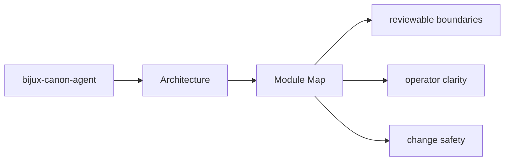
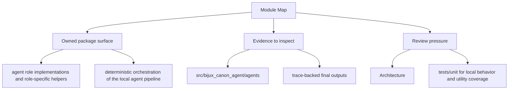

# Module Map

The architecture of `bijux-canon-agent` is easiest to understand from the major module groups.

## Page Maps

## Major Modules

- `src/bijux_canon_agent/agents` for role-local behavior
- `src/bijux_canon_agent/pipeline` for execution flow orchestration
- `src/bijux_canon_agent/application` for workflow policy and graph logic
- `src/bijux_canon_agent/llm` for LLM runtime integration support
- `src/bijux_canon_agent/interfaces` for CLI boundaries and operator helpers
- `src/bijux_canon_agent/traces` for trace-facing models and persistence helpers

## Concrete Anchors

- `src/bijux_canon_agent/agents` for role-local behavior
- `src/bijux_canon_agent/pipeline` for execution flow orchestration
- `src/bijux_canon_agent/application` for workflow policy and graph logic

## Use This Page When

- you are tracing internal structure or execution flow
- you need to understand where modules fit before refactoring
- you are reviewing architectural drift instead of one local bug

## What This Page Answers

- how bijux-canon-agent is structured internally
- which modules control the main execution path
- where architectural drift would become visible first

## Reviewer Lens

- trace the claimed execution path through the listed modules
- look for dependency direction that now contradicts the documented seam
- verify that architectural risks still match the current code structure

## Honesty Boundary

This page describes the current structural model of bijux-canon-agent, but it does not by itself prove that every import or runtime path still obeys that model.

## Purpose

This page provides a shortest-path code map for the package.

## Stability

Keep it aligned with the actual source directories under `packages/bijux-canon-agent`.

## Core Claim

The architectural claim of `bijux-canon-agent` is that its structure is deliberate enough for a reviewer to trace responsibilities, dependencies, and drift pressure without reverse-engineering the entire codebase.

## Why It Matters

If the architecture pages for `bijux-canon-agent` are weak, refactors become guesswork and dependency drift can hide until failures show up in tests or production-facing behavior.

## If It Drifts

- dependency direction becomes harder to inspect quickly
- refactors can land without anyone noticing structural regressions until later
- code navigation becomes slower because the documented map no longer matches reality
