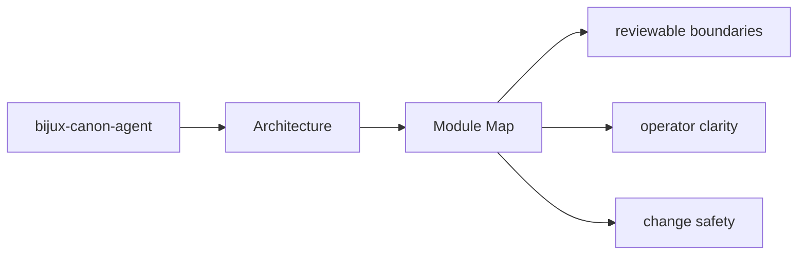
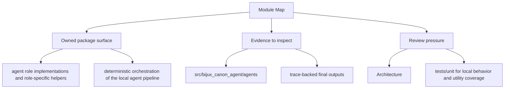

# Module Map

The architecture of `bijux-canon-agent` is easiest to understand from the major module groups.

## Page Maps

## Major Modules

- `src/bijux_canon_agent/agents` for role-local behavior
- `src/bijux_canon_agent/pipeline` for execution flow orchestration
- `src/bijux_canon_agent/application` for workflow policy and graph logic
- `src/bijux_canon_agent/llm` for LLM runtime integration support
- `src/bijux_canon_agent/interfaces` for CLI boundaries and operator helpers
- `src/bijux_canon_agent/traces` for trace-facing models and persistence helpers

## Purpose

This page provides a shortest-path code map for the package.

## Stability

Keep it aligned with the actual source directories under `packages/bijux-canon-agent`.
