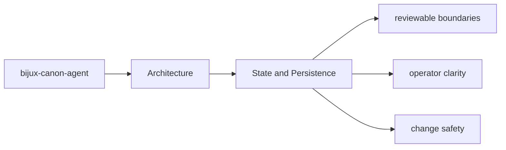

# State and Persistence

State in `bijux-canon-agent` should be explicit enough that a maintainer can say what is
transient, what is serialized, and what neighboring packages must not assume.

## Page Maps

## Durable Surfaces

- trace-backed final outputs
- workflow graph execution records
- operator-visible result artifacts

## Code Areas to Inspect

- `src/bijux_canon_agent/agents` for role-local behavior
- `src/bijux_canon_agent/pipeline` for execution flow orchestration
- `src/bijux_canon_agent/application` for workflow policy and graph logic
- `src/bijux_canon_agent/llm` for LLM runtime integration support
- `src/bijux_canon_agent/interfaces` for CLI boundaries and operator helpers
- `src/bijux_canon_agent/traces` for trace-facing models and persistence helpers

## Purpose

This page marks the package's state and artifact boundary.

## Stability

Keep it aligned with the actual artifact shapes and serialized outputs.
