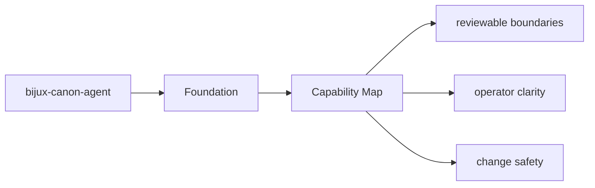
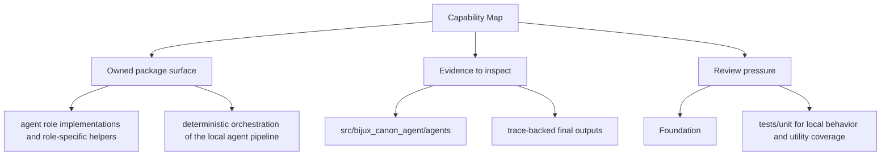

# Capability Map

The package capabilities can be read as a map from modules to behavior.

## Page Maps

## Capability Map

- `src/bijux_canon_agent/agents` for role-local behavior
- `src/bijux_canon_agent/pipeline` for execution flow orchestration
- `src/bijux_canon_agent/application` for workflow policy and graph logic
- `src/bijux_canon_agent/llm` for LLM runtime integration support
- `src/bijux_canon_agent/interfaces` for CLI boundaries and operator helpers
- `src/bijux_canon_agent/traces` for trace-facing models and persistence helpers

## Produced Artifacts

- trace-backed final outputs
- workflow graph execution records
- operator-visible result artifacts

## What This Page Answers

- what bijux-canon-agent is expected to own
- what remains outside the package boundary
- which neighboring seams a reviewer should compare next

## Purpose

This page helps a reader quickly map package claims to code areas.

## Stability

Keep it aligned with the real package modules and generated outputs.
