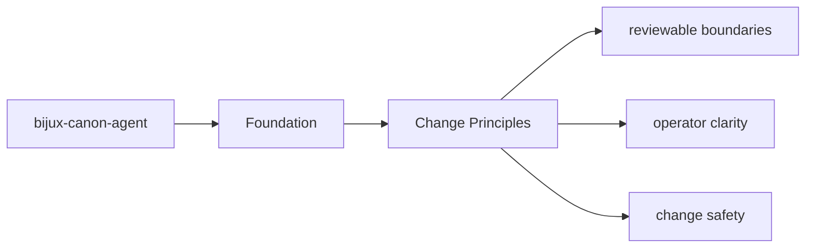
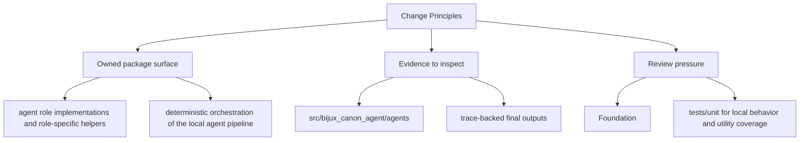

# Change Principles

Changes in `bijux-canon-agent` should keep the package boundary easier to understand, not harder.

## Page Maps

## Principles

- prefer moving behavior toward the owning package instead of letting boundary overlap grow
- update docs and tests in the same change series that changes package behavior
- keep names stable and descriptive enough to survive years of maintenance

## Purpose

This page records the package-specific contribution posture.

## Stability

Update these principles only when the package operating model truly changes.
