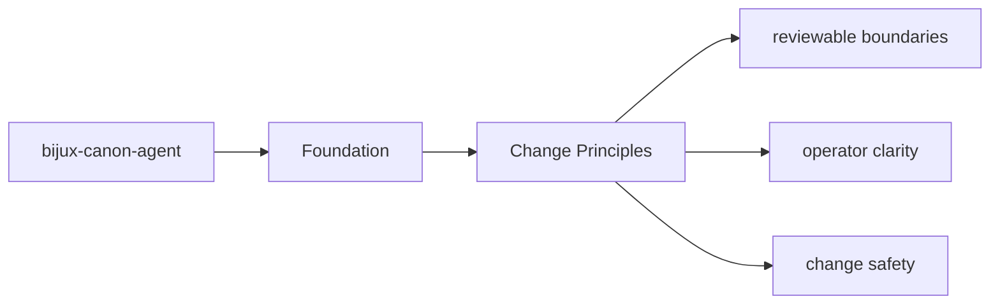
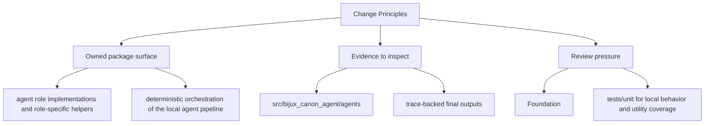

# Change Principles

Changes in `bijux-canon-agent` should keep the package boundary easier to understand, not harder.

## Page Maps

## Principles

- prefer moving behavior toward the owning package instead of letting boundary overlap grow
- update docs and tests in the same change series that changes package behavior
- keep names stable and descriptive enough to survive years of maintenance

## Concrete Anchors

- `packages/bijux-canon-agent` as the package root
- `packages/bijux-canon-agent/src/bijux_canon_agent` as the import boundary
- `packages/bijux-canon-agent/tests` as the package proof surface

## Use This Page When

- you need the package boundary before reading implementation detail
- you are deciding whether work belongs in this package or a neighboring one
- you need the shortest stable description of package intent

## What This Page Answers

- what bijux-canon-agent is expected to own
- what remains outside the package boundary
- which neighboring seams a reviewer should compare next

## Reviewer Lens

- compare the stated package boundary with the owned modules and tests
- check that out-of-scope work is not quietly reintroduced through adjacent packages
- confirm that the package description still matches the real repository layout

## Honesty Boundary

This page can explain the intended boundary of bijux-canon-agent, but it does not replace the code and tests that ultimately prove that boundary.

## Purpose

This page records the package-specific contribution posture.

## Stability

Update these principles only when the package operating model truly changes.

## Core Claim

The foundational claim of `bijux-canon-agent` is that its package boundary can be explained in stable ownership terms instead of by implementation accident.

## Why It Matters

If the foundation pages for `bijux-canon-agent` are weak, reviewers stop knowing where the package boundary really is and adjacent packages begin absorbing behavior by convenience instead of design.

## If It Drifts

- ownership starts migrating by convenience instead of by explicit package boundary
- neighboring packages inherit responsibilities without deliberate review
- reviewers lose confidence that the package description still means anything stable

## Representative Scenario

A contributor proposes moving new behavior into `bijux-canon-agent` because it is nearby in the repository. This page should make it obvious whether that work fits the package boundary or belongs in a neighboring package instead.

## Source Of Truth Order

- `packages/bijux-canon-agent/src/bijux_canon_agent` for the real ownership boundary in code
- `packages/bijux-canon-agent/tests` for executable proof of that boundary
- `packages/bijux-canon-agent/README.md` and this section for the shortest maintained framing
