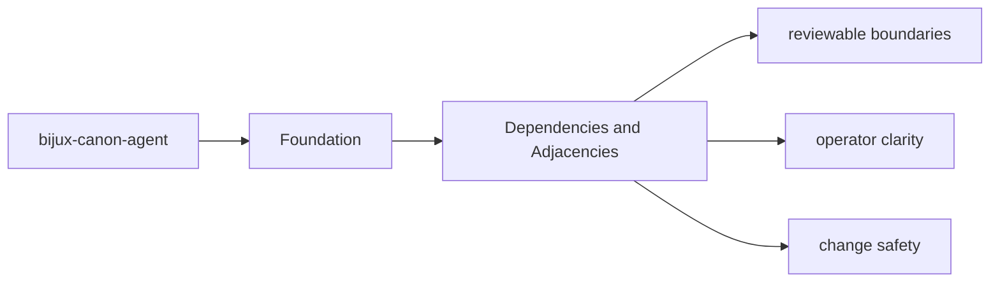
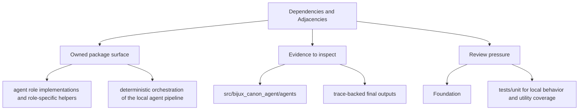

# Dependencies and Adjacencies

Package dependencies matter because they reveal which behavior is local and which behavior is delegated.

## Page Maps

## Direct Dependency Themes

- aiohttp
- typer
- click
- pydantic
- fastapi
- openai
- structlog
- pluggy

## Adjacent Package Relationships

- coordinates work that may call ingest, reason, and runtime components
- leans on runtime for governed execution and replay acceptance

## Use This Page When

- you need the package boundary before reading implementation detail
- you are deciding whether work belongs in this package or a neighboring one
- you need the shortest stable description of package intent

## What This Page Answers

- what bijux-canon-agent is expected to own
- what remains outside the package boundary
- which neighboring seams a reviewer should compare next

## Purpose

This page explains which surrounding tools and packages `bijux-canon-agent` depends on to do its job.

## Stability

Keep it aligned with `pyproject.toml` and the actual package seams.
