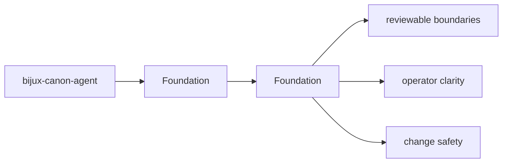
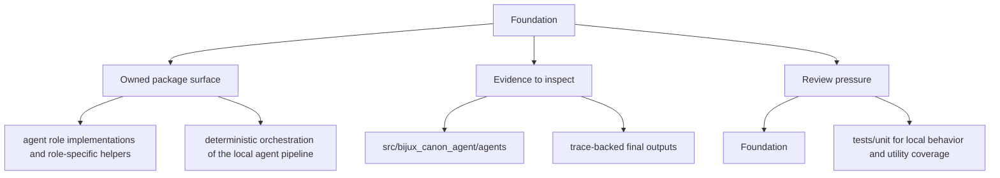

# Foundation

bijux-canon-agent exists to own deterministic, auditable agent orchestration with role-local behavior, pipeline control, and trace-backed results.

Read the foundation pages for `bijux-canon-agent` as the package's durable self-description: they should explain the package in terms that remain intelligible even after ordinary refactors.

## Page Maps

## Pages in This Section

- [Package Overview](package-overview.md)
- [Scope and Non-Goals](scope-and-non-goals.md)
- [Ownership Boundary](ownership-boundary.md)
- [Repository Fit](repository-fit.md)
- [Capability Map](capability-map.md)
- [Domain Language](domain-language.md)
- [Lifecycle Overview](lifecycle-overview.md)
- [Dependencies and Adjacencies](dependencies-and-adjacencies.md)
- [Change Principles](change-principles.md)

## Read Across the Package

- [Architecture](../architecture/index.md)
- [Interfaces](../interfaces/index.md)
- [Operations](../operations/index.md)
- [Quality](../quality/index.md)

## Concrete Anchors

- `packages/bijux-canon-agent` as the package root
- `packages/bijux-canon-agent/src/bijux_canon_agent` as the import boundary
- `packages/bijux-canon-agent/tests` as the package proof surface

## Use This Page When

- you need the package boundary before reading implementation detail
- you are deciding whether work belongs in this package or a neighboring one
- you need the shortest stable description of package intent

## Decision Rule

Use `Foundation` to decide whether a change clarifies or blurs `bijux-canon-agent` as a bounded package. If the work expands package authority without a cleaner ownership story, the default answer should be to stop and re-check the boundary before implementation continues.

## Next Checks

- move to architecture when the question becomes structural rather than boundary-oriented
- move to interfaces when the question becomes contract-facing
- move to quality when the question becomes proof or review sufficiency

## Update This Page When

- package ownership moves between this package and a neighboring one
- the package description, core outputs, or boundary modules materially change
- tests or docs reveal that the old boundary explanation is no longer accurate

## What This Page Answers

- what bijux-canon-agent is expected to own
- what remains outside the package boundary
- which neighboring seams a reviewer should compare next

## Reviewer Lens

- compare the stated package boundary with the owned modules and tests
- check that out-of-scope work is not quietly reintroduced through adjacent packages
- confirm that the package description still matches the real repository layout

## Honesty Boundary

This page can explain the intended boundary of bijux-canon-agent, but it does not replace the code and tests that ultimately prove that boundary.

## Section Contract

- define what the foundation section covers for bijux-canon-agent
- point readers to the topic pages that hold the detailed explanations
- keep the section boundary reviewable as the package evolves

## Reading Advice

- start here when you know the package but not yet the right page inside the section
- use the page list to choose the narrowest topic that matches the current question
- move across sections only after this section stops being the right lens

## Purpose

This page explains how to use the foundation section for `bijux-canon-agent` without repeating the detail that belongs on the topic pages beneath it.

## Stability

This page is part of the canonical package docs spine. Keep it aligned with the current package boundary and the topic pages in this section.

## What Good Looks Like

- `Foundation` leaves a reviewer able to explain `bijux-canon-agent` in one boundary sentence without hand-waving
- the owned and out-of-scope areas read as complementary rather than contradictory
- neighboring packages become easier to place because this package is clearly bounded

## Failure Signals

- `Foundation` has to explain the same ownership claim with repeated exceptions
- the out-of-scope list starts looking like shadow ownership instead of a real boundary
- review conversations keep falling back to package adjacency rather than package intent

## Cross Implications

- changes here influence how neighboring packages are allowed to stay narrow around `bijux-canon-agent`
- a weak boundary explanation raises architectural and quality ambiguity immediately
- interface and operations pages inherit confusion when foundational ownership is unclear

## Core Claim

The foundational claim of `bijux-canon-agent` is that its package boundary can be explained in stable ownership terms instead of by implementation accident.

## Why It Matters

If the foundation pages for `bijux-canon-agent` are weak, reviewers stop knowing where the package boundary really is and adjacent packages begin absorbing behavior by convenience instead of design.

## If It Drifts

- ownership starts migrating by convenience instead of by explicit package boundary
- neighboring packages inherit responsibilities without deliberate review
- reviewers lose confidence that the package description still means anything stable

## Representative Scenario

A contributor proposes moving new behavior into `bijux-canon-agent` because it is nearby in the repository. This page should make it obvious whether that work fits the package boundary or belongs in a neighboring package instead.

## Source Of Truth Order

- `packages/bijux-canon-agent/src/bijux_canon_agent` for the real ownership boundary in code
- `packages/bijux-canon-agent/tests` for executable proof of that boundary
- `packages/bijux-canon-agent/README.md` and this section for the shortest maintained framing

## Common Misreadings

- that `bijux-canon-agent` owns any nearby behavior just because it is convenient
- that a boundary statement is enough without the code and tests that enforce it
- that out-of-scope means unimportant rather than owned elsewhere
