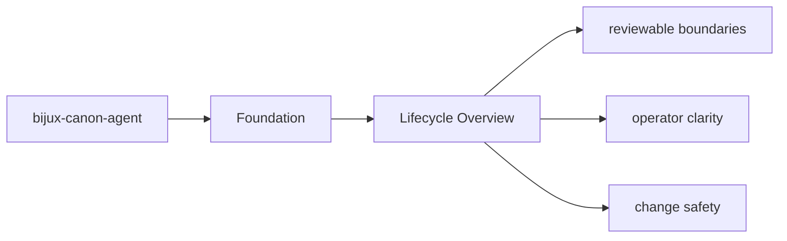
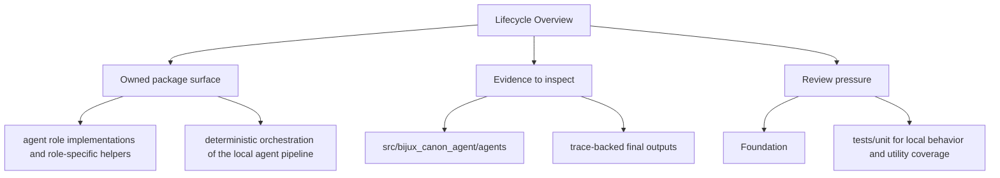

# Lifecycle Overview

Every package run follows a simple lifecycle: inputs enter through interfaces, domain and
application code coordinate the work, and durable artifacts or responses leave the package.

Read the foundation pages for `bijux-canon-agent` as the package's durable self-description: they should explain the package in terms that remain intelligible even after ordinary refactors.

## Page Maps

## Lifecycle Anchors

- entry surfaces: CLI entrypoint in src/bijux_canon_agent/interfaces/cli/entrypoint.py, operator configuration under src/bijux_canon_agent/config, HTTP-adjacent modules under src/bijux_canon_agent/api
- code ownership: src/bijux_canon_agent/agents, src/bijux_canon_agent/pipeline, src/bijux_canon_agent/application
- durable outputs: trace-backed final outputs, workflow graph execution records, operator-visible result artifacts

## Concrete Anchors

- `packages/bijux-canon-agent` as the package root
- `packages/bijux-canon-agent/src/bijux_canon_agent` as the import boundary
- `packages/bijux-canon-agent/tests` as the package proof surface

## Use This Page When

- you need the package boundary before reading implementation detail
- you are deciding whether work belongs in this package or a neighboring one
- you need the shortest stable description of package intent

## Decision Rule

Use `Lifecycle Overview` to decide whether a change clarifies or blurs `bijux-canon-agent` as a bounded package. If the work expands package authority without a cleaner ownership story, the default answer should be to stop and re-check the boundary before implementation continues.

## Next Checks

- move to architecture when the question becomes structural rather than boundary-oriented
- move to interfaces when the question becomes contract-facing
- move to quality when the question becomes proof or review sufficiency

## Update This Page When

- package ownership moves between this package and a neighboring one
- the package description, core outputs, or boundary modules materially change
- tests or docs reveal that the old boundary explanation is no longer accurate

## What This Page Answers

- what bijux-canon-agent is expected to own
- what remains outside the package boundary
- which neighboring seams a reviewer should compare next

## Reviewer Lens

- compare the stated package boundary with the owned modules and tests
- check that out-of-scope work is not quietly reintroduced through adjacent packages
- confirm that the package description still matches the real repository layout

## Honesty Boundary

This page can explain the intended boundary of bijux-canon-agent, but it does not replace the code and tests that ultimately prove that boundary.

## Purpose

This page keeps the package lifecycle readable before a reader dives into implementation detail.

## Stability

Keep it aligned with the current entrypoints and produced outputs.

## What Good Looks Like

- `Lifecycle Overview` leaves a reviewer able to explain `bijux-canon-agent` in one boundary sentence without hand-waving
- the owned and out-of-scope areas read as complementary rather than contradictory
- neighboring packages become easier to place because this package is clearly bounded

## Failure Signals

- `Lifecycle Overview` has to explain the same ownership claim with repeated exceptions
- the out-of-scope list starts looking like shadow ownership instead of a real boundary
- review conversations keep falling back to package adjacency rather than package intent

## Tradeoffs To Hold

- prefer clean ownership over local convenience, even when a nearby package looks easier to reuse
- prefer an explicit boundary gap over a shadow responsibility that no package clearly owns
- prefer keeping `bijux-canon-agent` intelligible as a bounded package over making it look universally useful

## Cross Implications

- changes here influence how neighboring packages are allowed to stay narrow around `bijux-canon-agent`
- a weak boundary explanation raises architectural and quality ambiguity immediately
- interface and operations pages inherit confusion when foundational ownership is unclear

## Approval Questions

- does `Lifecycle Overview` still let a reviewer state `bijux-canon-agent` ownership in one clear sentence
- does the change preserve package boundaries without creating shadow scope in a neighbor
- is there concrete code and test evidence behind the boundary claim rather than prose alone

## Evidence Checklist

- read the owned module roots under `packages/bijux-canon-agent/src/bijux_canon_agent` with the boundary statement in mind
- inspect `packages/bijux-canon-agent/tests` for proof that the boundary is enforced instead of merely described
- check whether adjacent package docs now tell a conflicting ownership story

## Anti-Patterns

- using package adjacency as a substitute for package ownership
- letting boundary exceptions accumulate until they become the real rule
- writing boundary prose that cannot be checked against code or tests

## Escalate When

- the page can no longer explain ownership without repeated cross-package caveats
- a change proposal would shift authority between packages rather than stay local
- tests and docs disagree on who is supposed to own the behavior

## Core Claim

The foundational claim of `bijux-canon-agent` is that its package boundary can be explained in stable ownership terms instead of by implementation accident.

## Why It Matters

If the foundation pages for `bijux-canon-agent` are weak, reviewers stop knowing where the package boundary really is and adjacent packages begin absorbing behavior by convenience instead of design.

## If It Drifts

- ownership starts migrating by convenience instead of by explicit package boundary
- neighboring packages inherit responsibilities without deliberate review
- reviewers lose confidence that the package description still means anything stable

## Representative Scenario

A contributor proposes moving new behavior into `bijux-canon-agent` because it is nearby in the repository. This page should make it obvious whether that work fits the package boundary or belongs in a neighboring package instead.

## Source Of Truth Order

- `packages/bijux-canon-agent/src/bijux_canon_agent` for the real ownership boundary in code
- `packages/bijux-canon-agent/tests` for executable proof of that boundary
- `packages/bijux-canon-agent/README.md` and this section for the shortest maintained framing

## Common Misreadings

- that `bijux-canon-agent` owns any nearby behavior just because it is convenient
- that a boundary statement is enough without the code and tests that enforce it
- that out-of-scope means unimportant rather than owned elsewhere
