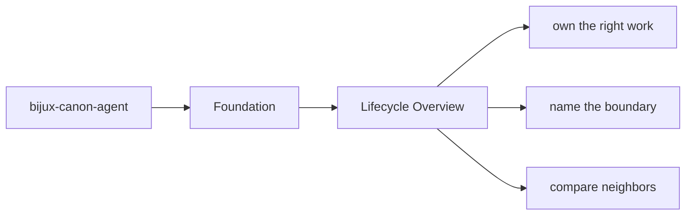
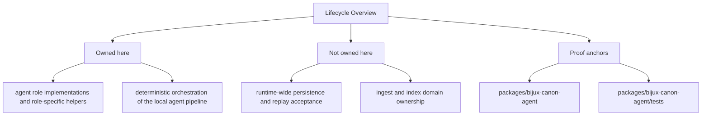

# Lifecycle Overview

Every package run follows a simple lifecycle: inputs enter through interfaces, domain and
application code coordinate the work, and durable artifacts or responses leave
the package.

The value of this page is speed. A reader should be able to skim it and leave
with one coherent story about how work moves through `bijux-canon-agent` from
entrypoint to result.

Read the foundation pages for `bijux-canon-agent` as the package's durable self-description. They should let a reader understand the package without needing to reconstruct its purpose from recent implementation history.

## Page Maps

## Lifecycle Anchors

- entry surfaces: CLI entrypoint in src/bijux_canon_agent/interfaces/cli/entrypoint.py, operator configuration under src/bijux_canon_agent/config, HTTP-adjacent modules under src/bijux_canon_agent/api
- code ownership: src/bijux_canon_agent/agents, src/bijux_canon_agent/pipeline, src/bijux_canon_agent/application
- durable outputs: trace-backed final outputs, workflow graph execution records, operator-visible result artifacts

## Concrete Anchors

- `packages/bijux-canon-agent` as the package root
- `packages/bijux-canon-agent/src/bijux_canon_agent` as the import boundary
- `packages/bijux-canon-agent/tests` as the package proof surface

## Use This Page When

- you need the package idea before the implementation detail
- you are deciding whether work belongs here or in a neighboring package
- you want the shortest honest explanation of what this package is for

## Decision Rule

Use `Lifecycle Overview` to decide whether a change makes `bijux-canon-agent` easier or harder to defend as one distinct role in the overall system. If the work makes the package broader without making its role clearer, stop and re-check the boundary before treating the change as a local improvement.

## What This Page Answers

- what problem `bijux-canon-agent` is supposed to own on purpose
- where the package boundary stops, even when nearby code looks tempting
- which neighboring package seams deserve comparison before the boundary is changed

## Reviewer Lens

- compare the stated boundary with the modules, artifacts, and tests that are supposed to uphold it
- check that out-of-scope behavior is not quietly re-entering through convenience paths
- confirm that the package story still matches the real repository layout and neighboring package docs

## Honesty Boundary

This page can explain the intended boundary of `bijux-canon-agent`, but it cannot prove that boundary by itself. The real proof still lives in the code, tests, and neighboring package seams that either support or contradict the story told here.

## Next Checks

- move to architecture when the question becomes structural rather than boundary-oriented
- move to interfaces when the question becomes contract-facing
- move to quality when the question becomes proof or review sufficiency

## Purpose

This page keeps the package lifecycle readable before a reader dives into implementation detail.

## Stability

Keep it aligned with the current entrypoints and produced outputs.
