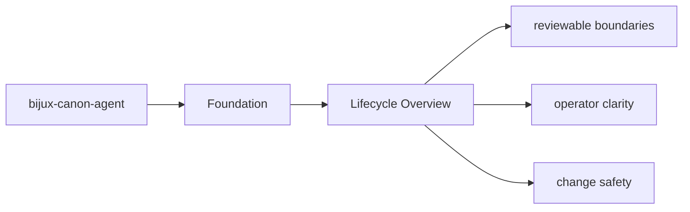
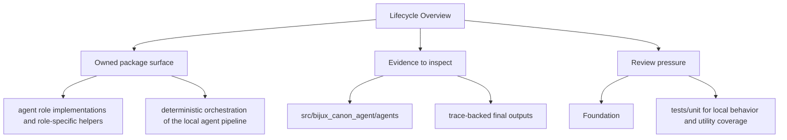

# Lifecycle Overview

Every package run follows a simple lifecycle: inputs enter through interfaces, domain and
application code coordinate the work, and durable artifacts or responses leave the package.

## Page Maps

## Lifecycle Anchors

- entry surfaces: CLI entrypoint in src/bijux_canon_agent/interfaces/cli/entrypoint.py, operator configuration under src/bijux_canon_agent/config, HTTP-adjacent modules under src/bijux_canon_agent/api
- code ownership: src/bijux_canon_agent/agents, src/bijux_canon_agent/pipeline, src/bijux_canon_agent/application
- durable outputs: trace-backed final outputs, workflow graph execution records, operator-visible result artifacts

## Purpose

This page keeps the package lifecycle readable before a reader dives into implementation detail.

## Stability

Keep it aligned with the current entrypoints and produced outputs.
