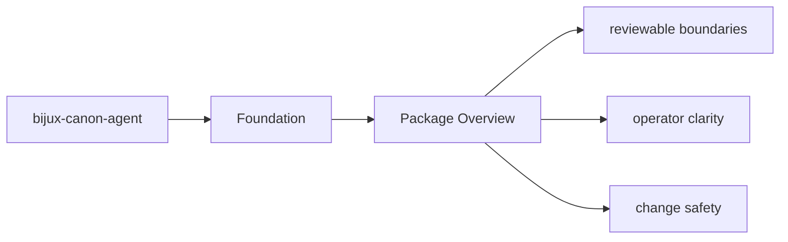
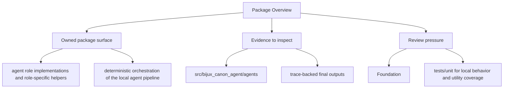

# Package Overview

`bijux-canon-agent` is the package that owns deterministic, auditable agent orchestration with role-local behavior, pipeline control, and trace-backed results.

## Page Maps

## What It Owns

- agent role implementations and role-specific helpers
- deterministic orchestration of the local agent pipeline
- trace-backed result artifacts that explain each run
- package-local CLI and HTTP boundaries for agent workflows

## What It Does Not Own

- runtime-wide persistence and replay acceptance
- ingest and index domain ownership
- repository tooling and release automation

## Concrete Anchors

- `packages/bijux-canon-agent` as the package root
- `packages/bijux-canon-agent/src/bijux_canon_agent` as the import boundary
- `packages/bijux-canon-agent/tests` as the package proof surface

## Use This Page When

- you need the package boundary before reading implementation detail
- you are deciding whether work belongs in this package or a neighboring one
- you need the shortest stable description of package intent

## What This Page Answers

- what bijux-canon-agent is expected to own
- what remains outside the package boundary
- which neighboring seams a reviewer should compare next

## Reviewer Lens

- compare the stated package boundary with the owned modules and tests
- check that out-of-scope work is not quietly reintroduced through adjacent packages
- confirm that the package description still matches the real repository layout

## Honesty Boundary

This page can explain the intended boundary of bijux-canon-agent, but it does not replace the code and tests that ultimately prove that boundary.

## Purpose

This page gives the shortest honest description of what the package is for.

## Stability

Keep it aligned with the real package boundary described by the code and tests.

## Core Claim

The foundational claim of `bijux-canon-agent` is that its package boundary can be explained in stable ownership terms instead of by implementation accident.

## Why It Matters

If the foundation pages for `bijux-canon-agent` are weak, reviewers stop knowing where the package boundary really is and adjacent packages begin absorbing behavior by convenience instead of design.

## If It Drifts

- ownership starts migrating by convenience instead of by explicit package boundary
- neighboring packages inherit responsibilities without deliberate review
- reviewers lose confidence that the package description still means anything stable

## Representative Scenario

A contributor proposes moving new behavior into `bijux-canon-agent` because it is nearby in the repository. This page should make it obvious whether that work fits the package boundary or belongs in a neighboring package instead.
