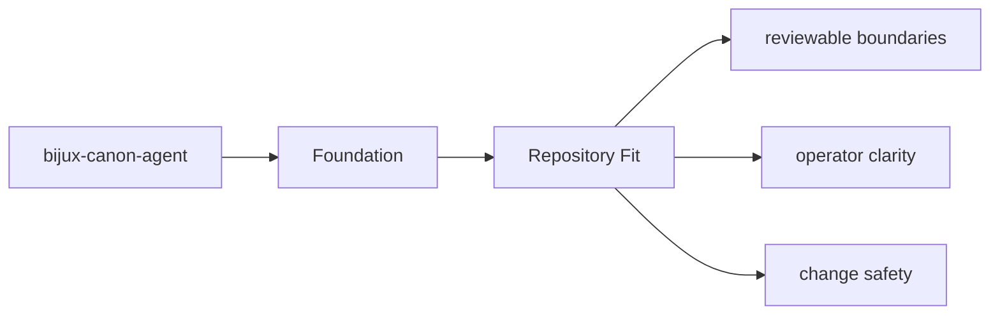

# Repository Fit

`bijux-canon-agent` sits inside the monorepo as one publishable package with its own `src/`,
tests, metadata, and release history.

## Page Maps

## Repository Relationships

- coordinates work that may call ingest, reason, and runtime components
- leans on runtime for governed execution and replay acceptance

## Canonical Package Root

- `packages/bijux-canon-agent`
- `packages/bijux-canon-agent/src/bijux_canon_agent`
- `packages/bijux-canon-agent/tests`

## Purpose

This page explains how the package fits into the repository without restating repository-wide rules.

## Stability

Keep it aligned with the package's checked-in directories and actual neighboring packages.
