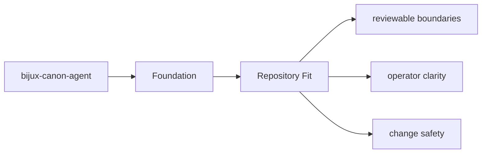
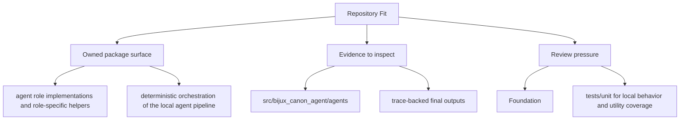

# Repository Fit

`bijux-canon-agent` sits inside the monorepo as one publishable package with its own `src/`,
tests, metadata, and release history.

## Page Maps

## Repository Relationships

- coordinates work that may call ingest, reason, and runtime components
- leans on runtime for governed execution and replay acceptance

## Canonical Package Root

- `packages/bijux-canon-agent`
- `packages/bijux-canon-agent/src/bijux_canon_agent`
- `packages/bijux-canon-agent/tests`

## Concrete Anchors

- `packages/bijux-canon-agent` as the package root
- `packages/bijux-canon-agent/src/bijux_canon_agent` as the import boundary
- `packages/bijux-canon-agent/tests` as the package proof surface

## Use This Page When

- you need the package boundary before reading implementation detail
- you are deciding whether work belongs in this package or a neighboring one
- you need the shortest stable description of package intent

## What This Page Answers

- what bijux-canon-agent is expected to own
- what remains outside the package boundary
- which neighboring seams a reviewer should compare next

## Reviewer Lens

- compare the stated package boundary with the owned modules and tests
- check that out-of-scope work is not quietly reintroduced through adjacent packages
- confirm that the package description still matches the real repository layout

## Honesty Boundary

This page can explain the intended boundary of bijux-canon-agent, but it does not replace the code and tests that ultimately prove that boundary.

## Purpose

This page explains how the package fits into the repository without restating repository-wide rules.

## Stability

Keep it aligned with the package's checked-in directories and actual neighboring packages.
