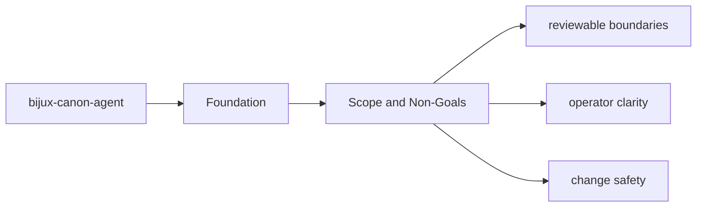
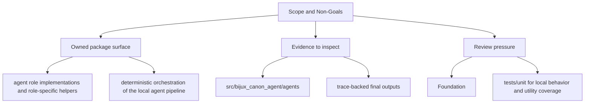

# Scope and Non-Goals

The package boundary exists so neighboring packages can evolve without hidden overlap.

## Page Maps

## In Scope

- agent role implementations and role-specific helpers
- deterministic orchestration of the local agent pipeline
- trace-backed result artifacts that explain each run
- package-local CLI and HTTP boundaries for agent workflows

## Out of Scope

- runtime-wide persistence and replay acceptance
- ingest and index domain ownership
- repository tooling and release automation

## What This Page Answers

- what bijux-canon-agent is expected to own
- what remains outside the package boundary
- which neighboring seams a reviewer should compare next

## Purpose

This page keeps future work from leaking into the wrong package.

## Stability

Update it only when ownership truly moves into or out of `bijux-canon-agent`.
