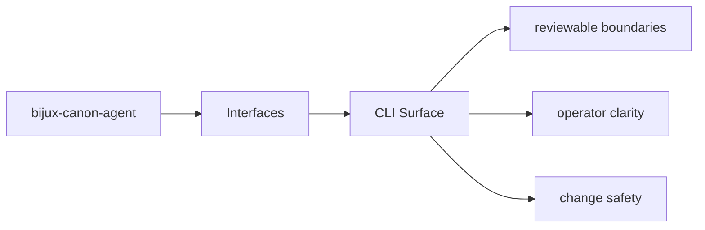
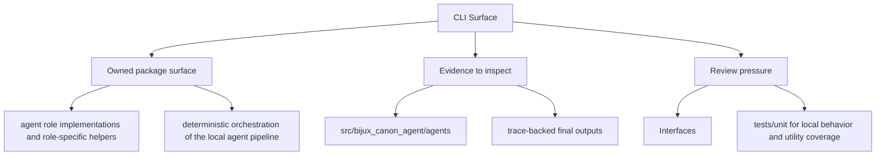

# CLI Surface

The CLI surface is the operator-facing command layer for `bijux-canon-agent`.

## Page Maps

## Command Facts

- canonical command: `bijux-canon-agent`
- interface modules: CLI entrypoint in src/bijux_canon_agent/interfaces/cli/entrypoint.py, operator configuration under src/bijux_canon_agent/config, HTTP-adjacent modules under src/bijux_canon_agent/api

## Concrete Anchors

- CLI entrypoint in src/bijux_canon_agent/interfaces/cli/entrypoint.py
- operator configuration under src/bijux_canon_agent/config
- HTTP-adjacent modules under src/bijux_canon_agent/api
- apis/bijux-canon-agent/v1/schema.yaml

## Use This Page When

- you need the public command, API, import, or artifact surface
- you are checking whether a caller can rely on a given shape or entrypoint
- you need the contract-facing side of the package before using it

## What This Page Answers

- which public or operator-facing surfaces bijux-canon-agent exposes
- which artifacts and schemas act like contracts
- what compatibility pressure this surface creates

## Reviewer Lens

- compare commands, API files, imports, and artifacts against the documented surface
- check whether schema or artifact changes need compatibility review
- confirm that operator-facing examples still point at real entrypoints

## Honesty Boundary

This page can identify the intended public surfaces of bijux-canon-agent, but real compatibility still depends on code, schemas, artifacts, and tests staying aligned.

## Purpose

This page points maintainers toward the command entrypoints and their owning code.

## Stability

Keep it aligned with the declared scripts and the interface modules that implement them.
