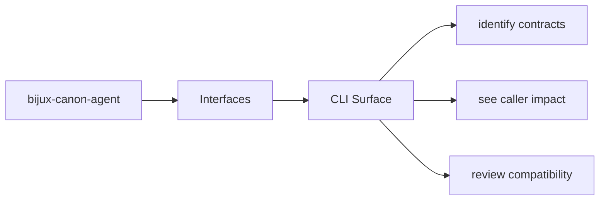
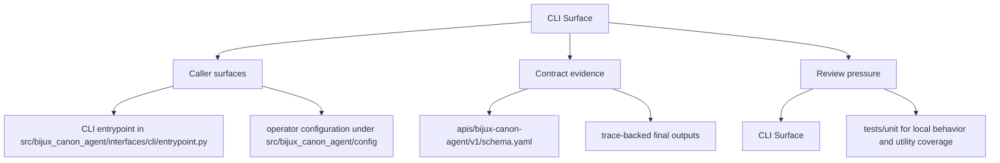

# CLI Surface

The CLI surface is the operator-facing command layer for `bijux-canon-agent`. It
should tell a reader which commands are deliberate entrypoints and which ones
are just local implementation detail.

Command surfaces tend to become contracts early, because people script them,
share them in tickets, and paste them into automation. This page should make
that contract status visible instead of accidental.

Read the interfaces pages for `bijux-canon-agent` as the bridge between implementation and caller expectation. They should tell a reader what the package is prepared to stand behind before a downstream dependency forms.

## Page Maps

## Command Facts

- canonical command: `bijux-canon-agent`
- interface modules: CLI entrypoint in src/bijux_canon_agent/interfaces/cli/entrypoint.py, operator configuration under src/bijux_canon_agent/config, HTTP-adjacent modules under src/bijux_canon_agent/api

## Concrete Anchors

- CLI entrypoint in src/bijux_canon_agent/interfaces/cli/entrypoint.py
- operator configuration under src/bijux_canon_agent/config
- HTTP-adjacent modules under src/bijux_canon_agent/api
- apis/bijux-canon-agent/v1/schema.yaml

## Use This Page When

- you need the public command, API, import, schema, or artifact surface
- you are checking whether a caller can safely rely on a given entrypoint or shape
- you want the contract-facing side of the package before building on it

## Decision Rule

Use `CLI Surface` to decide whether a caller-facing surface is explicit enough to depend on. If the surface cannot be tied back to concrete code, schemas, artifacts, examples, and tests, treat it as unstable until that evidence is visible.

## What This Page Answers

- which public or operator-facing surfaces `bijux-canon-agent` is really asking readers to trust
- which schemas, artifacts, imports, or commands behave like contracts
- what compatibility pressure a change to this surface would create

## Reviewer Lens

- compare commands, schemas, imports, and artifacts against the documented surface one by one
- check whether a seemingly local change actually needs compatibility review
- confirm that examples still point to real entrypoints and not to stale habits

## Honesty Boundary

This page can identify the intended public surfaces of `bijux-canon-agent`, but real compatibility depends on code, schemas, artifacts, examples, and tests staying aligned. If those disagree, the prose is wrong or incomplete.

## Next Checks

- move to operations when the caller-facing question becomes procedural or environmental
- move to quality when compatibility or evidence of protection becomes the real issue
- move back to architecture when a public-surface question reveals a deeper structural drift

## Purpose

This page points maintainers toward the command entrypoints and their owning code.

## Stability

Keep it aligned with the declared scripts and the interface modules that implement them.
