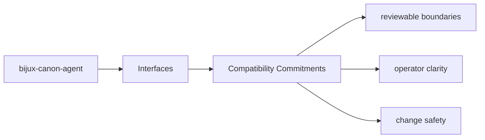
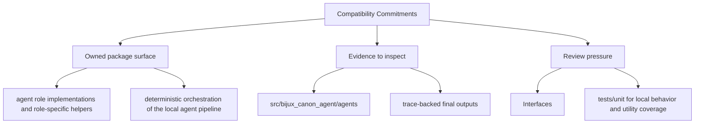

# Compatibility Commitments

Compatibility in `bijux-canon-agent` should be explicit: stable commands, tracked schemas,
durable artifacts, and release notes that explain intentional breakage.

## Page Maps

## Compatibility Anchors

- README.md
- CHANGELOG.md
- pyproject.toml

## Review Rule

Breaking changes must be visible in code, docs, and validation together.

## Use This Page When

- you need the public command, API, import, or artifact surface
- you are checking whether a caller can rely on a given shape or entrypoint
- you need the contract-facing side of the package before using it

## What This Page Answers

- which public or operator-facing surfaces bijux-canon-agent exposes
- which artifacts and schemas act like contracts
- what compatibility pressure this surface creates

## Reviewer Lens

- compare commands, API files, imports, and artifacts against the documented surface
- check whether schema or artifact changes need compatibility review
- confirm that operator-facing examples still point at real entrypoints

## Purpose

This page describes what should trigger compatibility review for the package.

## Stability

Keep it aligned with the package's actual public surfaces and release process.
