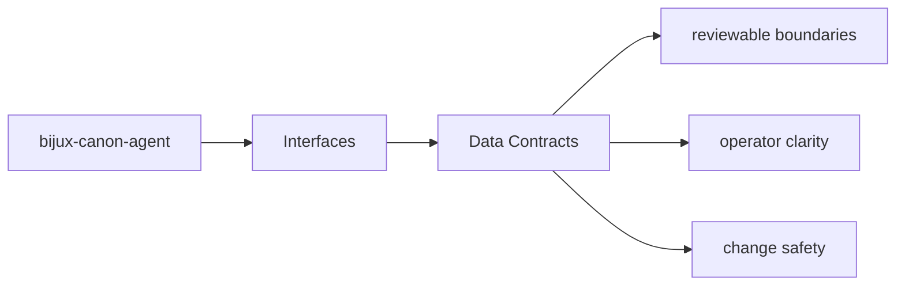
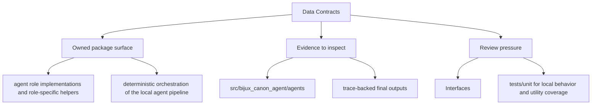

# Data Contracts

Data contracts in `bijux-canon-agent` include schemas, structured models, and any stable
payload shape that neighboring systems are expected to understand.

## Page Maps

## Contract Anchors

- apis/bijux-canon-agent/v1/schema.yaml

## Artifact Anchors

- trace-backed final outputs
- workflow graph execution records
- operator-visible result artifacts

## Use This Page When

- you need the public command, API, import, or artifact surface
- you are checking whether a caller can rely on a given shape or entrypoint
- you need the contract-facing side of the package before using it

## What This Page Answers

- which public or operator-facing surfaces bijux-canon-agent exposes
- which artifacts and schemas act like contracts
- what compatibility pressure this surface creates

## Purpose

This page explains which structured shapes deserve compatibility review.

## Stability

Keep it aligned with tracked schemas, stable models, and durable artifacts.
