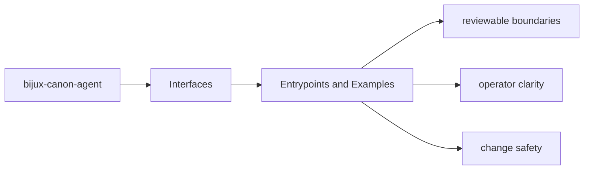

# Entrypoints and Examples

The fastest way to understand the package interfaces is to pair entrypoints with concrete examples.

## Page Maps

## Entrypoints

- CLI entrypoint in src/bijux_canon_agent/interfaces/cli/entrypoint.py
- operator configuration under src/bijux_canon_agent/config
- HTTP-adjacent modules under src/bijux_canon_agent/api

## Example Anchors

- tests/e2e and tests/fixtures as executable examples
- config/execution_policy.yaml as a concrete policy surface

## Purpose

This page records where maintainers can find real invocation examples instead of inventing them from scratch.

## Stability

Keep it aligned with the checked-in examples, fixtures, and executable tests.
